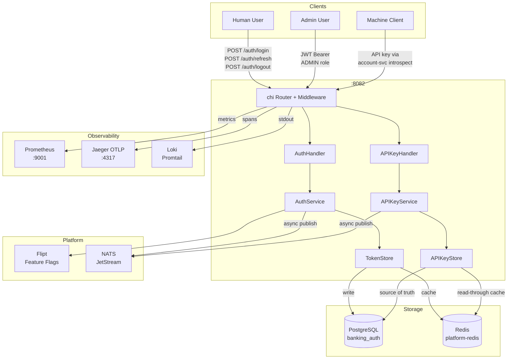
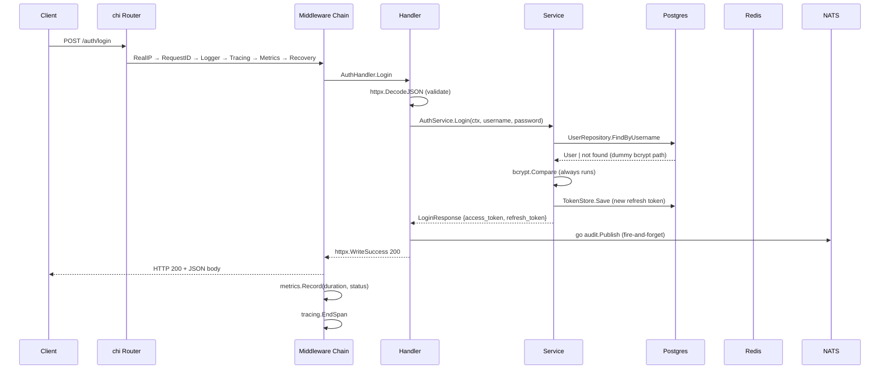
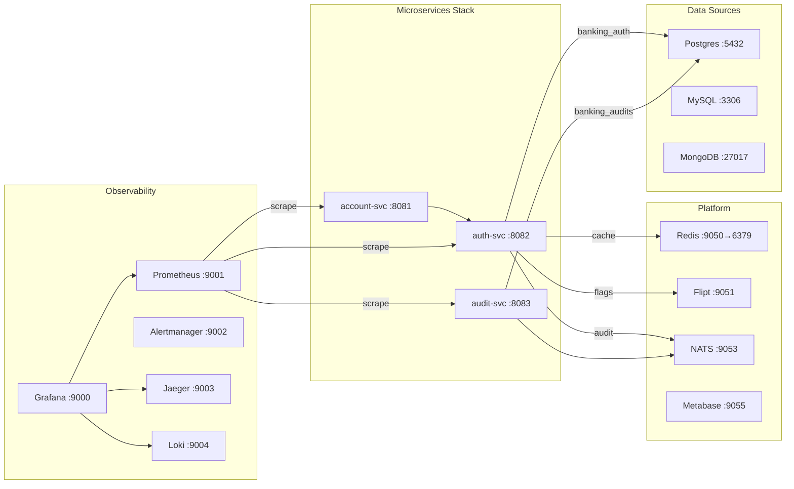

# architecture.md — auth-svc

> **Purpose:** Convert the business understanding in [context.md](context.md) into technical design. All decisions must satisfy requirements in [goals.md](goals.md).

---

## 1. High-Level Architecture



---

## 2. Service Architecture

### Layering (→ CLAUDE.md, NFR-16, NFR-17)

```
┌─────────────────────────────────┐
│  Transport Layer                │  HTTP handlers (thin — decode, call service, respond)
│  internal/transport/            │
├─────────────────────────────────┤
│  Service Layer                  │  Business logic, orchestration, audit publishing
│  internal/services/             │
├─────────────────────────────────┤
│  Repository / Store Layer       │  Interface abstraction over storage backends
│  internal/repository/           │
├─────────────────────────────────┤
│  DAO Layer                      │  Database struct definitions (GORM tags)
│  internal/domain/dao/           │
└─────────────────────────────────┘
         │
         ▼
┌─────────────────────────────────┐
│  pkg/ (shared, import-only)     │  audit, crypto, database, errors, httpx, middleware, …
└─────────────────────────────────┘
```

**Rule:** each layer only imports the layer immediately below it. `pkg/` is never imported by other pkg packages that would create cycles.

---

## 3. Component Architecture

### 3.1 Entry Point (`cmd/server/`)

| File | Responsibility |
|---|---|
| `main.go` | Config load → logger setup → container build → OTEL init → HTTP server → graceful shutdown (SIGTERM/SIGINT, 30 s) |
| `container.go` | Dependency wiring: OTEL → RSA key parse → DB migrate → Postgres → stores → services → feature flags → audit → middleware → router → idempotency → HTTP server |
| `migrate.go` | Runs embedded SQL migrations via `golang-migrate` at startup |

### 3.2 Handlers

| Handler | Routes | Auth |
|---|---|---|
| `AuthHandler` | `POST /auth/login`, `/auth/refresh`, `/auth/logout` | Public |
| `APIKeyHandler` | `POST /internal/service-accounts`, `GET /internal/service-accounts`, `GET/PATCH /internal/service-accounts/{id}`, `GET/POST/DELETE /internal/service-accounts/{id}/api-keys` | JWT + ADMIN role |
| `APIKeyHandler` | `POST /auth/apikey/introspect` | Internal (Docker network) |
| `InspectHandler` | `POST /auth/inspect` | Local dev only |

### 3.3 Services

**AuthService** (→ FR-01 to FR-08)
- `Login(ctx, username, password)` → `(LoginResponse, error)`
- `Refresh(ctx, refreshToken)` → `(LoginResponse, error)`
- `Logout(ctx, refreshToken)` → `error`

**APIKeyService** (→ FR-09 to FR-16)
- `CreateServiceAccount(ctx, req)` → `(*ServiceAccount, error)`
- `GetServiceAccount(ctx, id)` → `(*ServiceAccount, error)`
- `UpdateServiceAccount(ctx, id, req)` → `(*ServiceAccount, error)`
- `ListServiceAccounts(ctx, tenantID)` → `([]*ServiceAccount, error)`
- `CreateAPIKey(ctx, saID, req)` → `(*CreateAPIKeyResponse, error)` (returns raw key once)
- `ListAPIKeys(ctx, saID)` → `([]*APIKeyInfo, error)`
- `RevokeAPIKey(ctx, saID, keyID)` → `error`
- `IntrospectAPIKey(ctx, hash)` → `(*ServiceAccountIdentity, error)`

### 3.4 Repository Interfaces

```go
// TokenStore — pluggable refresh token backend (→ FR-17, FR-18, FR-19)
type TokenStore interface {
    Save(ctx context.Context, token *dao.RefreshToken) error
    FindByHash(ctx context.Context, hash string) (*dao.RefreshToken, error)
    Revoke(ctx context.Context, hash string) error
    RevokeAllForUser(ctx context.Context, userID string) error
}

// APIKeyStore — hot-path key resolution (→ FR-14, FR-15)
type APIKeyStore interface {
    Save(ctx context.Context, key *dao.APIKey) error
    FindActiveByHash(ctx context.Context, hash string) (*ServiceAccountIdentity, error)
    Revoke(ctx context.Context, keyID, hash string) error
    ListByServiceAccount(ctx context.Context, saID string) ([]*dao.APIKey, error)
    UpdateLastUsed(ctx context.Context, keyID string) error
}
```

### 3.5 Data Access Objects (`internal/domain/dao/`)

| Struct | Table | Notes |
|---|---|---|
| `User` | `users` | `Roles` as custom `StringArray` (text[] in Postgres) |
| `RefreshToken` | `refresh_tokens` | Stores `token_hash` (SHA-256), never raw token |
| `ServiceAccount` | `service_accounts` | `Roles` as `StringArray`, `is_active` flag |
| `APIKey` | `api_keys` | Stores `key_hash` + `key_prefix`; `revoked_at` nullable |

---

## 4. Package Structure

```
services/auth-svc/
├── cmd/server/
│   ├── main.go           ← entry point
│   ├── container.go      ← DI wiring
│   └── migrate.go        ← DB migration runner
├── config/
│   └── config.go         ← env config, fail-fast validation
├── internal/
│   ├── domain/
│   │   ├── dao/          ← DB structs (GORM tags)
│   │   └── dto/          ← request/response types
│   ├── services/         ← business logic
│   ├── repository/       ← storage interfaces + implementations
│   └── transport/        ← HTTP handlers, router, middleware registration
├── migrations/           ← embedded SQL migration files
├── Dockerfile
├── go.mod
└── .env.example
```

---

## 5. Request Lifecycle



---

## 6. Data Flow

### 6.1 Token Storage Decision Tree (→ FR-17, FR-18, NFR-15)

```
TOKEN_STORE env var
      │
      ├── "redis"   → RedisTokenStore    (TTL-based, fast; Postgres fallback on error)
      ├── "memory"  → MemoryTokenStore   (in-process map; testing only)
      └── default   → PostgresTokenStore (durable)
```

### 6.2 API Key Store Architecture (→ FR-14, FR-15, NFR-03, NFR-04)

```
Request: FindActiveByHash(hash)
         │
         ▼
   Redis Cache hit?
   ┌──── YES ──────────────────────────────┐
   │                                        │
   │  Deserialize ServiceAccountIdentity    │
   │  Update last_used_at async             │
   │  Return identity                       │
   └────────────────────────────────────────┘
         │ NO
         ▼
   Postgres JOIN query
   (api_keys + service_accounts, partial index WHERE revoked_at IS NULL)
         │
         ├── Not found / revoked / expired / SA inactive → 401
         │
         └── Found → Populate Redis cache (TTL = min(5 min, remaining key TTL))
                   → Update last_used_at async
                   → Return identity
```

### 6.3 Audit Event Flow (→ FR-22, BO-04, NFR-14)

```
Service layer calls:
  go func() {
      _ = h.audit.Publish(context.Background(), AuditEvent{...})
  }()
        │
        ▼ (async goroutine)
  AsyncPublisher
        │
        ├── NATS available → NATSPublisher → publish to "audit.{action}"
        │
        └── NATS unavailable → NoopPublisher → slog.Warn (never 500)
```

---

## 7. Storage Design

### 7.1 Schema: `banking_auth`

```sql
-- Users (seed only; no create endpoint yet)
CREATE TABLE users (
    id           TEXT PRIMARY KEY,
    username     TEXT UNIQUE NOT NULL,
    email        TEXT UNIQUE NOT NULL,
    password_hash TEXT NOT NULL,              -- bcrypt cost ≥ 12
    roles        TEXT[] NOT NULL DEFAULT '{}',
    tenant_id    TEXT NOT NULL DEFAULT 'default',
    is_active    BOOLEAN NOT NULL DEFAULT TRUE,
    created_at   TIMESTAMPTZ NOT NULL DEFAULT NOW(),
    updated_at   TIMESTAMPTZ NOT NULL DEFAULT NOW()
);

-- Refresh tokens (hashed; raw never stored)
CREATE TABLE refresh_tokens (
    id          UUID PRIMARY KEY DEFAULT gen_random_uuid(),
    user_id     TEXT NOT NULL,
    token_hash  TEXT UNIQUE NOT NULL,         -- SHA-256 hex
    expires_at  TIMESTAMPTZ NOT NULL,
    revoked     BOOLEAN NOT NULL DEFAULT FALSE,
    created_at  TIMESTAMPTZ NOT NULL DEFAULT NOW()
);
CREATE INDEX idx_refresh_tokens_user ON refresh_tokens(user_id);

-- Service accounts (non-human identities)
CREATE TABLE service_accounts (
    id          TEXT PRIMARY KEY,
    name        TEXT NOT NULL,
    description TEXT,
    tenant_id   TEXT NOT NULL DEFAULT 'default',
    roles       TEXT[] NOT NULL DEFAULT '{}',
    is_active   BOOLEAN NOT NULL DEFAULT TRUE,
    created_by  TEXT NOT NULL,
    created_at  TIMESTAMPTZ NOT NULL DEFAULT NOW(),
    updated_at  TIMESTAMPTZ NOT NULL DEFAULT NOW()
);

-- API keys (hashed; raw never stored)
CREATE TABLE api_keys (
    id                  UUID PRIMARY KEY DEFAULT gen_random_uuid(),
    service_account_id  TEXT NOT NULL REFERENCES service_accounts(id),
    name                TEXT NOT NULL,
    key_hash            TEXT UNIQUE NOT NULL,   -- SHA-256 hex
    key_prefix          TEXT NOT NULL,          -- first 10 chars for display
    expires_at          TIMESTAMPTZ,
    revoked_at          TIMESTAMPTZ,            -- NULL = active
    last_used_at        TIMESTAMPTZ,
    created_by          TEXT NOT NULL,
    created_at          TIMESTAMPTZ NOT NULL DEFAULT NOW()
);
-- Hot-path partial index for introspection
CREATE UNIQUE INDEX idx_api_keys_active_hash ON api_keys(key_hash)
    WHERE revoked_at IS NULL;

-- Idempotency requests
CREATE TABLE idempotency_requests (
    idempotency_key TEXT PRIMARY KEY,
    response_body   BYTEA,
    status          TEXT NOT NULL,   -- 'pending' | 'completed' | 'failed'
    created_at      TIMESTAMPTZ NOT NULL DEFAULT NOW(),
    expires_at      TIMESTAMPTZ NOT NULL
);
```

### 7.2 Redis Key Design

| Key pattern | Value | TTL | Purpose |
|---|---|---|---|
| `apikey:{sha256hex}` | JSON `ServiceAccountIdentity` | min(5 min, key expiry) | API key introspection cache |
| `refresh:{sha256hex}` | JSON `RefreshToken` | token expiry | Token store (when `TOKEN_STORE=redis`) |
| `revoked_before:{userID}` | Unix timestamp | 7 days | Bulk revocation marker for user (Redis store only) |
| `idempotency:{key}` | JSON response | 24 h | Idempotency cache (dual-store Redis layer) |

---

## 8. API Design

### 8.1 Public Endpoints

```
POST /auth/login
  Body:    { "username": string, "password": string }
  200:     { "access_token": string, "refresh_token": string, "expires_in": int, "token_type": "Bearer" }
  401:     { "error": "UNAUTHORIZED", "message": "invalid credentials" }
  503:     { "error": "SERVICE_UNAVAILABLE", "message": "service is under maintenance" }

POST /auth/refresh
  Body:    { "refresh_token": string }
  200:     { "access_token": string, "refresh_token": string, "expires_in": int, "token_type": "Bearer" }
  401:     { "error": "UNAUTHORIZED", "message": "token expired|revoked|not found" }

POST /auth/logout
  Body:    { "refresh_token": string }
  204:     (no body)
  401:     { "error": "UNAUTHORIZED" }
```

### 8.2 Internal Endpoint (Docker network only)

```
POST /auth/apikey/introspect
  Body:    { "hash": string }          ← SHA-256 of raw key, never raw key itself
  200:     { "sa_id": string, "tenant_id": string, "roles": [string], "key_id": string }
  401:     { "error": "UNAUTHORIZED", "message": "key not found|revoked|expired" }
```

### 8.3 Admin Endpoints (JWT + ADMIN role required)

```
POST   /internal/service-accounts
GET    /internal/service-accounts
GET    /internal/service-accounts/{id}
PATCH  /internal/service-accounts/{id}
POST   /internal/service-accounts/{id}/api-keys
GET    /internal/service-accounts/{id}/api-keys
DELETE /internal/service-accounts/{id}/api-keys/{keyId}
```

### 8.4 Observability Endpoints

```
GET /healthz/live    → 200 OK always
GET /healthz/ready   → 200 OK if Postgres (+ Redis if configured) reachable
GET /metrics         → Prometheus text format
```

### 8.5 Response Envelope (→ pkg/httpx)

```json
// Success
{ "data": <payload>, "request_id": "<uuid>" }

// Error
{ "error": "<ERROR_CODE>", "message": "<human string>", "request_id": "<uuid>" }

// Validation error
{ "error": "VALIDATION_ERROR", "details": [{ "field": "...", "message": "..." }], "request_id": "<uuid>" }
```

---

## 9. Integration Patterns

### 9.1 Flipt Feature Flags (→ FR-06, NFR-12)

```go
enabled, err := featureflag.IsEnabled(ctx, "maintenance_mode", false)
if enabled {
    httpx.WriteHTTPError(w, r, httpx.NewHTTPError(http.StatusServiceUnavailable, "SERVICE_UNAVAILABLE", "..."))
    return
}
```

Evaluated once per login request. If Flipt is unreachable, `IsEnabled` returns `false` (default value), keeping login available.

### 9.2 NATS Audit Publishing (→ FR-22, NFR-14)

```go
go func() {
    _ = h.audit.Publish(context.Background(), pkgaudit.AuditEvent{
        Action:     pkgaudit.ActionAuthLogin,
        Status:     pkgaudit.StatusSuccess,
        ActorType:  "user",
        ActorID:    userID,
        ResourceID: userID,
        Metadata:   map[string]any{"ip": r.RemoteAddr},
    })
}()
```

The goroutine is fire-and-forget. Failures log a warning but never propagate to the HTTP response. This satisfies NFR-14.

### 9.3 Idempotency (→ FR-24)

Dual-store: writes go to both Redis (fast read) and Postgres (durable). Reads come from Redis first. A `DualStore` struct in `pkg/idempotency` orchestrates this. Middleware extracts the `Idempotency-Key` header, checks the store, and short-circuits if the request was already processed.

---

## 10. Security Design

### 10.1 Authentication Mechanisms

| Mechanism | Algorithm | Key | Notes |
|---|---|---|---|
| Access token (JWT) | RS256 | RSA-2048 private key | auth-svc signs; all others verify with public key |
| Refresh token | SHA-256 HMAC | — | UUID value; hash stored in DB; single-use |
| API key | SHA-256 | — | Raw = `bp_live_<base62>`; hash stored; never raw in DB |
| Subject encryption | AES-256-GCM | 32-byte random key | Hides user ID inside JWT Subject claim |
| Password | bcrypt | cost ≥ 12 | Always run even for unknown users (timing safety) |

### 10.2 Threat Mitigations

| Threat | Mitigation |
|---|---|
| User enumeration via timing | Dummy bcrypt always runs on unknown username |
| JWT forgery | RS256 with 2048-bit key; private key injected via env, never committed |
| Refresh token replay | Single-use rotation; hash stored, not raw value |
| API key replay after revoke | Cache delete on revoke; Postgres is source of truth |
| Token leakage → user ID exposure | Subject encrypted with AES-256-GCM |
| Cross-environment API key reuse | `bp_live_` prefix rejected in non-production |
| Introspect endpoint abuse | Accessible only within `banking-net` (future: shared-secret header) |
| Brute force | bcrypt cost throttles attempt rate; future: rate limiting middleware |

### 10.3 RBAC Model

| Role | Capabilities |
|---|---|
| `ADMIN` | All `/internal/service-accounts/*` endpoints |
| `USER` | No management endpoints; account-svc endpoints only |
| Service Account | Scoped to roles assigned at creation; varies per SA |

---

## 11. Observability Design

### 11.1 Metrics (→ FR-20)

| Metric | Type | Labels | Purpose |
|---|---|---|---|
| `http_requests_total` | Counter | `method`, `path`, `status` | Request rate, error rate |
| `http_request_duration_seconds` | Histogram | `method`, `path`, `status` | Latency SLO tracking (NFR-01 to NFR-04) |

Registered in `pkg/middleware/metrics.go`, emitted on every request in middleware chain.

### 11.2 Tracing (→ FR-21)

Spans created for:
- Every HTTP request (chi middleware via `pkg/middleware/tracing.go`)
- `AuthService.Login`, `AuthService.Refresh`
- `APIKeyService.IntrospectAPIKey`
- Postgres queries (GORM OTEL plugin)

Span attributes: `user_id`, `username`, `error`, `http.method`, `http.route`, `http.status_code`.

### 11.3 Logging (→ NFR-16, CLAUDE.md)

- Structured JSON via `slog`; level configurable via `LOG_LEVEL` env var.
- Each request log includes: `request_id`, `method`, `path`, `status`, `latency`, `user_id` (if authenticated).
- Errors include: `error`, `trace_id` for correlation with Jaeger.

### 11.4 Health Checks (→ FR-23)

| Endpoint | Check | Failure action |
|---|---|---|
| `/healthz/live` | Always 200 | — |
| `/healthz/ready` | Postgres ping (+ Redis ping if configured) | 503 with `{"ready": false, "checks": {...}}` |

---

## 12. Scalability Considerations (→ NFR-11)

- **Stateless handlers** — no in-process session state; every request is self-contained.
- **Token stores are external** — Redis or Postgres; multiple auth-svc replicas share the same store.
- **API key cache in Redis** — shared cache is consistent across replicas; a revoke from any replica invalidates for all.
- **Bottleneck** — bcrypt at login (intentionally slow; ~100 ms at cost 12). Login throughput is constrained. Mitigations: horizontal scaling of auth-svc replicas; rate limiting upstream.
- **Read scaling** — API key introspection (hot path) is fully served from Redis. Postgres only on cache miss.

---

## 13. Reliability Considerations (→ NFR-14, NFR-15)

| Failure | Behaviour |
|---|---|
| Redis unavailable | TokenStore falls back to Postgres. APIKeyStore falls back to Postgres on cache miss. 0 user-visible errors. |
| Flipt unavailable | `maintenance_mode` defaults to `false`. Login continues. |
| NATS unavailable | Audit publisher switches to NoopPublisher. No 5xx; audit events lost until NATS recovers (JetStream will catch up on reconnect). |
| Postgres unavailable | Auth fails 503. Readiness probe fails immediately. Load balancer removes pod from rotation. |
| Container crash | Graceful shutdown (30 s) drains in-flight requests before exit. NATS connection flushed. |

---

## 14. Deployment Architecture



All containers join `banking-net` (created by platform stack). Startup order: datasource → platform → microservices → monitoring.
