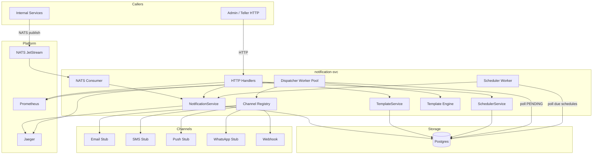
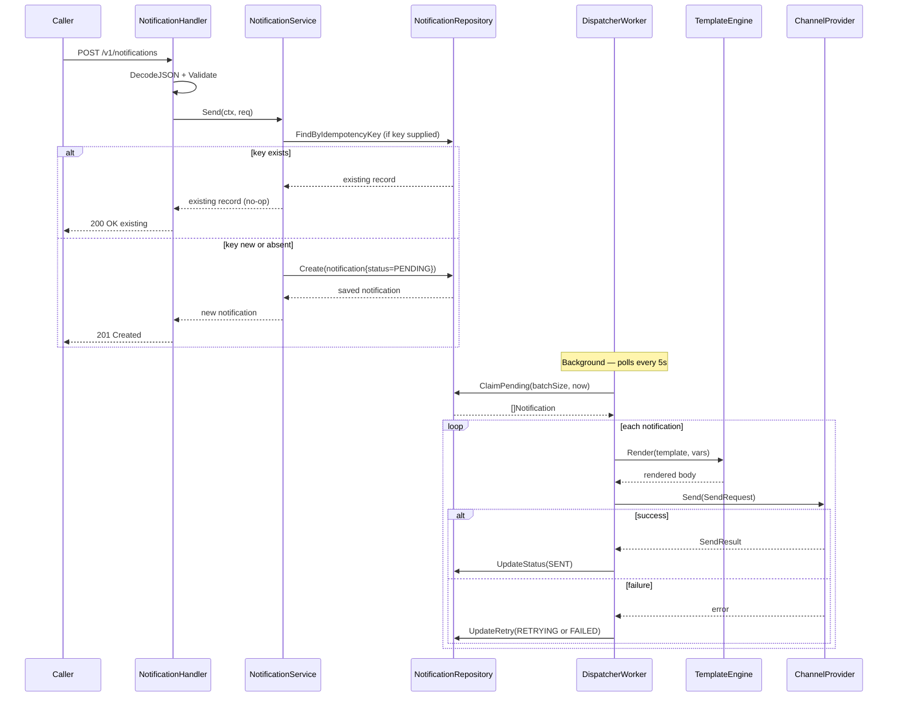

# notification-svc — Architecture

## High-Level Architecture



---

## Service Architecture (Layers)

```
┌──────────────────────────────────────────────────────────┐
│  Transport (HTTP handlers + NATS consumer + routes)       │
│  — thin adapters: decode → validate → call service       │
├──────────────────────────────────────────────────────────┤
│  Services (NotificationService, TemplateService,          │
│            SchedulerService)                             │
│  — business logic, no HTTP knowledge                     │
├──────────────────────────────────────────────────────────┤
│  Repository (interfaces + GORM implementations)          │
│  — data access only, returns domain errors               │
├──────────────────────────────────────────────────────────┤
│  DAO (GORM models)                                        │
├──────────────────────────────────────────────────────────┤
│  Worker (Dispatcher + Scheduler)                         │
│  — background goroutines; call service layer             │
├──────────────────────────────────────────────────────────┤
│  Channel (interface + per-channel implementations)       │
│  — channel abstraction; satisfies FR-02                  │
├──────────────────────────────────────────────────────────┤
│  Template Engine (html/template + text/template)         │
└──────────────────────────────────────────────────────────┘
```

---

## Component Architecture

| Component | Location | Role |
|---|---|---|
| `main.go` | `cmd/server/` | Entry point; config → logger → build → run |
| `container.go` | `cmd/server/` | DI wiring: OTel → DB → NATS → repos → svcs → handlers → workers → router |
| `migrate.go` | `cmd/server/` | Runs golang-migrate at startup |
| `config.go` | `config/` | Env var loading + validation |
| `notification.go` | `dao/` | GORM model for `notifications` table |
| `template.go` | `dao/` | GORM model for `templates` table |
| `schedule.go` | `dao/` | GORM model for `schedules` table |
| `notification.go` | `dto/` | Request/response DTOs for notifications |
| `template.go` | `dto/` | Request/response DTOs for templates |
| `schedule.go` | `dto/` | Request/response DTOs for schedules |
| `channel.go` | `channel/` | `Channel` interface + `SendRequest` + `SendResult` types |
| `registry.go` | `channel/` | `Registry` — registers and resolves channels by type |
| `email/email.go` | `channel/email/` | Email stub provider |
| `sms/sms.go` | `channel/sms/` | SMS stub provider |
| `push/push.go` | `channel/push/` | Push notification stub provider |
| `whatsapp/whatsapp.go` | `channel/whatsapp/` | WhatsApp stub provider |
| `webhook/webhook.go` | `channel/webhook/` | Webhook HTTP POST provider |
| `engine.go` | `template/` | Template render engine (html/template + text/template) |
| `notification_repository.go` | `repository/` | CRUD + filtering for notifications |
| `template_repository.go` | `repository/` | CRUD for templates |
| `schedule_repository.go` | `repository/` | CRUD for schedules |
| `notification_service.go` | `services/` | Send, Retry, Cancel, Get, List |
| `template_service.go` | `services/` | Create, Update, Delete, Get, List, Preview |
| `scheduler_service.go` | `services/` | Create, Update, Delete, Enable, Disable, Get, List |
| `dispatcher.go` | `worker/` | Goroutine pool; polls and dispatches PENDING notifications |
| `scheduler.go` | `worker/` | Single goroutine; fires due schedules |
| `notification_handler.go` | `transport/` | HTTP handlers for /v1/notifications |
| `template_handler.go` | `transport/` | HTTP handlers for /v1/templates |
| `schedule_handler.go` | `transport/` | HTTP handlers for /v1/schedules |
| `consumer.go` | `transport/` | NATS JetStream subscriber |
| `routes.go` | `transport/` | chi router with middleware chain |
| `errors.go` | `transport/` | Domain error → HTTP status mapping |

---

## Package Structure

```
services/notification-svc/
├── cmd/server/               # entry point + DI
│   ├── main.go
│   ├── container.go
│   └── migrate.go
├── config/                   # env loading + validation
│   └── config.go
├── internal/
│   ├── channel/              # channel abstraction
│   │   ├── channel.go        # Channel interface, types
│   │   ├── registry.go       # Registry for channel lookup
│   │   ├── email/
│   │   ├── sms/
│   │   ├── push/
│   │   ├── whatsapp/
│   │   └── webhook/
│   ├── domain/
│   │   ├── dao/              # GORM models
│   │   └── dto/              # request/response types
│   ├── repository/           # data access interfaces + GORM implementations
│   ├── services/             # business logic
│   ├── template/             # template rendering engine
│   ├── transport/            # HTTP handlers + NATS consumer + router
│   └── worker/               # dispatcher + scheduler background workers
└── migrations/               # SQL .up.sql files
```

---

## Request Lifecycle (Send Notification)



---

## Storage Design

### Table: notifications (satisfies FR-16, FR-17)

```sql
CREATE TABLE notifications (
    id              TEXT PRIMARY KEY,
    channel         TEXT NOT NULL,
    recipient       TEXT NOT NULL,
    template_id     TEXT REFERENCES templates(id),
    template_code   TEXT,
    template_vars   JSONB,
    payload         JSONB,
    status          TEXT NOT NULL DEFAULT 'PENDING',
    provider_ref    TEXT,
    provider_resp   JSONB,
    error_message   TEXT,
    retry_count     INTEGER NOT NULL DEFAULT 0,
    max_retries     INTEGER NOT NULL DEFAULT 3,
    idempotency_key TEXT,
    schedule_id     TEXT REFERENCES schedules(id),
    scheduled_at    TIMESTAMPTZ,
    sent_at         TIMESTAMPTZ,
    delivered_at    TIMESTAMPTZ,
    created_at      TIMESTAMPTZ NOT NULL DEFAULT NOW(),
    updated_at      TIMESTAMPTZ NOT NULL DEFAULT NOW()
);
```

Indexes: `(status, scheduled_at)` for worker claim query; `(idempotency_key)` UNIQUE WHERE NOT NULL; `(channel)`, `(recipient)`, `(created_at DESC)` for filtering.

### Table: templates (satisfies FR-03, FR-06)

```sql
CREATE TABLE templates (
    id         TEXT PRIMARY KEY,
    code       TEXT NOT NULL,
    name       TEXT NOT NULL,
    channel    TEXT NOT NULL,
    format     TEXT NOT NULL DEFAULT 'TEXT',
    subject    TEXT,
    body       TEXT NOT NULL,
    variables  JSONB,
    version    INTEGER NOT NULL DEFAULT 1,
    active     BOOLEAN NOT NULL DEFAULT true,
    created_at TIMESTAMPTZ NOT NULL DEFAULT NOW(),
    updated_at TIMESTAMPTZ NOT NULL DEFAULT NOW()
);
```

Index: `(code, active)` for template lookup by code.

### Table: schedules (satisfies FR-20–FR-23)

```sql
CREATE TABLE schedules (
    id            TEXT PRIMARY KEY,
    name          TEXT NOT NULL,
    description   TEXT,
    channel       TEXT NOT NULL,
    template_code TEXT NOT NULL,
    recipient     TEXT NOT NULL,
    template_vars JSONB,
    cron_expr     TEXT,
    scheduled_at  TIMESTAMPTZ,
    recurring     BOOLEAN NOT NULL DEFAULT false,
    enabled       BOOLEAN NOT NULL DEFAULT true,
    last_run_at   TIMESTAMPTZ,
    next_run_at   TIMESTAMPTZ,
    created_at    TIMESTAMPTZ NOT NULL DEFAULT NOW(),
    updated_at    TIMESTAMPTZ NOT NULL DEFAULT NOW()
);
```

Index: `(enabled, next_run_at)` for scheduler claim query.

---

## API Design

All routes under `/v1/` require RS256 JWT or API key authentication.

### Notification API (FR-25)

| Method | Path | Auth | Description |
|---|---|---|---|
| POST | /v1/notifications | ADMIN, TELLER | Send notification |
| GET | /v1/notifications | ADMIN | List history with filters |
| GET | /v1/notifications/{id} | ADMIN, TELLER | Get notification detail |
| POST | /v1/notifications/{id}/retry | ADMIN | Retry failed notification |
| POST | /v1/notifications/{id}/cancel | ADMIN, TELLER | Cancel PENDING/RETRYING notification |

### Template API (FR-26)

| Method | Path | Auth | Description |
|---|---|---|---|
| POST | /v1/templates | ADMIN | Create template |
| GET | /v1/templates | ADMIN, TELLER | List templates |
| GET | /v1/templates/{id} | ADMIN, TELLER | Get template detail |
| PUT | /v1/templates/{id} | ADMIN | Update template (bumps version) |
| DELETE | /v1/templates/{id} | ADMIN | Soft delete (active=false) |
| POST | /v1/templates/{id}/preview | ADMIN, TELLER | Preview rendered template |

### Schedule API (FR-27)

| Method | Path | Auth | Description |
|---|---|---|---|
| POST | /v1/schedules | ADMIN | Create schedule |
| GET | /v1/schedules | ADMIN | List schedules |
| GET | /v1/schedules/{id} | ADMIN | Get schedule detail |
| PUT | /v1/schedules/{id} | ADMIN | Update schedule |
| DELETE | /v1/schedules/{id} | ADMIN | Delete schedule |
| POST | /v1/schedules/{id}/enable | ADMIN | Enable schedule |
| POST | /v1/schedules/{id}/disable | ADMIN | Disable schedule |

---

## Integration Patterns

| Integration | Pattern | Fallback |
|---|---|---|
| Incoming notifications | NATS JetStream consumer (async) | HTTP POST (sync, same handler) |
| Channel providers | Channel interface; provider stubs in v1 | Log and mark SENT in stub |
| Auth (JWT) | RS256 public key at startup | Reject with 401 |
| Auth (API key) | HTTP introspect auth-svc | Reject with 401 (no Redis in v1) |
| Template rendering | html/template + text/template (stdlib) | Return render error → notification FAILED |

---

## Security Design

### Authentication

| Mechanism | Implementation |
|---|---|
| RS256 JWT | `pkg/middleware.Authenticate` — validates signature, issuer, expiry |
| API key | `pkg/middleware.AuthenticateAPIKey` — calls auth-svc introspect |

### Threat → Mitigation

| Threat | Mitigation |
|---|---|
| Template injection | `html/template` auto-escapes output; text templates have no markup |
| Credential leakage in logs | Provider credentials loaded from env, never logged |
| Notification spoofing | Caller must be authenticated; no unauthenticated notification ingestion |
| Infinite retry loop | max_retries guard; FAILED is a terminal state |
| NATS message replay | JetStream at-least-once with durable consumer; idempotency key prevents double-send |

### RBAC

| Role | Permissions |
|---|---|
| ADMIN | Full access to all APIs |
| TELLER | Send notifications, list/get templates and notifications, cancel own notifications |

---

## Observability Design

### Metrics (satisfies FR-31)

| Metric | Type | Labels |
|---|---|---|
| `notification_sent_total` | Counter | `channel` |
| `notification_failed_total` | Counter | `channel` |
| `notification_retried_total` | Counter | `channel` |
| `notification_processing_duration_seconds` | Histogram | `channel` |
| `notification_queue_depth` | Gauge | — |
| `scheduled_jobs_executed_total` | Counter | — |
| `scheduled_jobs_failed_total` | Counter | — |

HTTP-level metrics (request count, latency, in-flight) are provided by `pkg/middleware.NewMetrics`.

### Tracing
- `NotificationService.*` methods: spans with `notification.id`, `notification.channel`
- `NotificationRepository.*` methods: spans with DB attributes
- `DispatcherWorker.process`: span per notification with `notification.channel`, `notification.retry_count`
- `TemplateEngine.Render`: span with `template.code`, `template.format`

### Logging
- `slog` with request_id, user_id context extractors
- Worker logs: notification_id, channel, status at INFO; error details at ERROR

### Health checks
- `/healthz/live` — always 200 if process running
- `/healthz/ready` — 200 only if Postgres reachable

---

## Scalability Considerations

- **HTTP tier**: stateless; scale horizontally behind load balancer (satisfies NFR-04)
- **Worker pool**: multiple instances compete on `UPDATE ... WHERE status='PENDING' ... LIMIT N FOR UPDATE SKIP LOCKED` — Postgres advisory locking ensures each notification processed once
- **Scheduler**: single goroutine per instance; multiple instances may fire the same schedule in parallel — next_run_at update is idempotent at the notification level via idempotency_key

---

## Reliability Considerations

| Dependency | Failure Mode | Impact | Mitigation |
|---|---|---|---|
| Postgres | Unavailable | All operations fail; workers stop | /healthz/ready returns 503; caller retries; NATS messages NAKed |
| NATS | Unavailable | Async notifications not consumed | HTTP path still works; NATS reconnects with MaxReconnects=-1 |
| Channel provider | Returns error | Notification marked RETRYING or FAILED | Retry with back-off; dead-letter after max_retries |
| Template not found | Template missing | Notification marked FAILED | Error captured in error_message |
