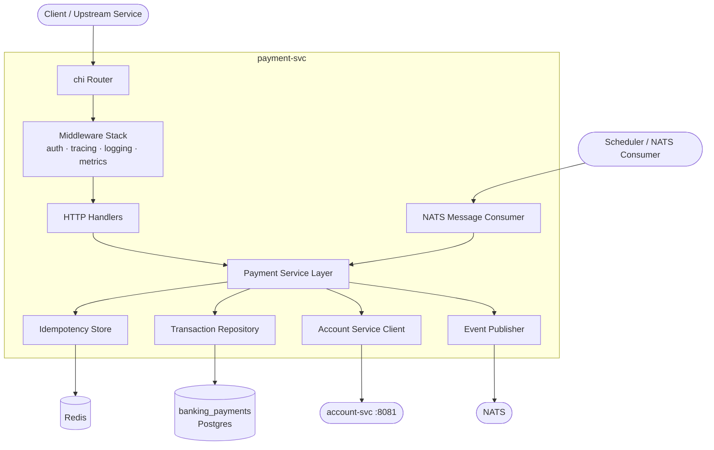
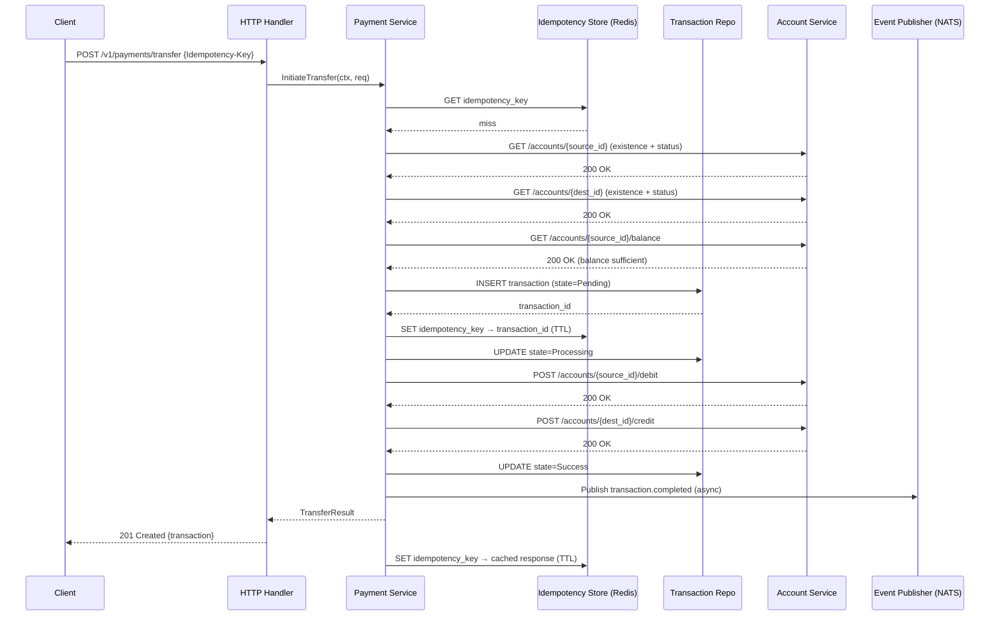

# Payment Service — Architecture

## High-Level Architecture



Satisfies: BO-01, BO-02, C-04, C-06

---

## Service Architecture — Layering

```
Transport layer       — HTTP handlers, NATS consumers, middleware
        ↓
Service layer         — business logic, orchestration, state machines
        ↓
Repository layer      — interface definitions (no SQL)
        ↓
DAO layer             — database structs, Postgres implementations
```

Rules:
- Handlers are thin; they decode, delegate to the service layer, and write responses via `pkg/httpx`
- Service layer owns all business rules, state transitions, and orchestration sequences
- Repository is always an interface; Postgres implementation is injected at startup
- No layer imports a layer above it; no circular imports

Satisfies: FR-01 – FR-20, C-01, C-04

---

## Component Architecture

| Component | Location | Responsibility |
|---|---|---|
| `cmd/payment-svc/main.go` | Entry point | Wire dependencies, start HTTP server and NATS consumer |
| `internal/transport/http/` | Transport | Route registration, handler structs, middleware |
| `internal/transport/nats/` | Transport | NATS subscription setup, message routing |
| `internal/service/` | Service | Business logic, orchestration, state machine |
| `internal/domain/repository/` | Repository | Interface definitions |
| `internal/domain/dao/` | DAO | Database structs |
| `internal/infra/postgres/` | Infrastructure | Postgres repository implementations |
| `internal/infra/redis/` | Infrastructure | Idempotency store implementation |
| `internal/infra/accountclient/` | Infrastructure | HTTP client for Account Service |
| `internal/infra/eventpublisher/` | Infrastructure | NATS event publisher |
| `internal/config/` | Config | Environment variable loading |
| `migrations/` | Migrations | SQL migration files |

---

## Package Structure

```
payment-svc/
├── cmd/
│   └── payment-svc/
│       └── main.go                  # entry point: wire + serve
├── internal/
│   ├── config/
│   │   └── config.go                # env config struct
│   ├── domain/
│   │   ├── dao/
│   │   │   ├── transaction.go       # transaction DB struct
│   │   │   └── idempotency.go       # idempotency record struct
│   │   └── repository/
│   │       ├── transaction.go       # TransactionRepository interface
│   │       └── idempotency.go       # IdempotencyRepository interface
│   ├── service/
│   │   ├── payment_service.go       # PaymentService interface + orchestration
│   │   ├── transfer.go              # transfer workflow
│   │   ├── reversal.go              # reversal workflow
│   │   ├── cancellation.go          # cancellation workflow
│   │   ├── retry.go                 # retry workflow
│   │   └── validation.go            # shared business rule validators
│   ├── transport/
│   │   ├── http/
│   │   │   ├── router.go            # route registration
│   │   │   ├── payment_handler.go   # initiation endpoints
│   │   │   ├── inquiry_handler.go   # inquiry endpoints
│   │   │   └── middleware/
│   │   │       ├── auth.go          # JWT validation
│   │   │       ├── tracing.go       # OTEL span injection
│   │   │       └── metrics.go       # request counter + latency
│   │   └── nats/
│   │       └── consumer.go          # async message consumer + router
│   └── infra/
│       ├── postgres/
│       │   ├── transaction_repo.go  # PostgresTransactionRepository
│       │   └── idempotency_repo.go  # PostgresIdempotencyRepository (fallback)
│       ├── redis/
│       │   └── idempotency_store.go # RedisIdempotencyStore (primary)
│       ├── accountclient/
│       │   └── client.go            # Account Service HTTP client
│       └── eventpublisher/
│           └── nats_publisher.go    # NATS event publisher
└── migrations/
    └── 001_create_payments_tables.sql
```

---

## Request Lifecycle — Happy Path Transfer



---

## Data Flow — Key Decision Points

### Idempotency check

```
Inbound request
    │
    ├── Idempotency-Key header missing → 400 Bad Request
    │
    ├── Key found in Redis (not expired) → return cached response (no processing)
    │
    ├── Key found in Redis (expired) → treat as new request
    │
    └── Key not found → proceed; SET NX in Redis
                            │
                            └── SET NX fails (race) → load existing record and return it
```

### Account Service call failure

```
Account Service call
    │
    ├── 2xx → proceed
    │
    ├── 4xx (account not found / insufficient balance) → terminal failure, record reason
    │
    ├── 5xx / timeout (recoverable)
    │       │
    │       ├── Retry with exponential backoff (up to N attempts)
    │       │
    │       └── Circuit breaker open → return 503 to caller immediately
    │
    └── Debit success + Credit failure → BW-02 compensation flow
```

### Event publishing

```
Transaction reaches terminal state
    │
    └── Publish to NATS (non-blocking goroutine)
            │
            ├── Success → done
            │
            └── Failure → local retry (3 attempts, 1s backoff)
                            │
                            └── Still failing → enqueue to DLQ topic
```

---

## Storage Design

### `banking_payments` — Postgres

```sql
CREATE TABLE transactions (
    id                  UUID PRIMARY KEY DEFAULT gen_random_uuid(),
    idempotency_key     VARCHAR(128)    NOT NULL UNIQUE,
    payment_type        VARCHAR(64)     NOT NULL,          -- TRANSFER, MERCHANT_PAYMENT, REFUND, FEE, SCHEDULED
    channel             VARCHAR(64)     NOT NULL,
    source_account_id   UUID            NOT NULL,
    destination_account_id UUID         NOT NULL,
    amount              NUMERIC(20, 4)  NOT NULL CHECK (amount > 0),
    currency            CHAR(3)         NOT NULL,
    status              VARCHAR(32)     NOT NULL,          -- PENDING, PROCESSING, SUCCESS, FAILED, CANCELLED, REVERSED
    failure_reason      VARCHAR(256),
    retry_count         INT             NOT NULL DEFAULT 0,
    max_retries         INT             NOT NULL DEFAULT 3,
    external_reference  VARCHAR(128),
    correlation_id      UUID,
    trace_id            VARCHAR(64),
    description         TEXT,
    metadata            JSONB,
    initiated_by        UUID            NOT NULL,          -- user or service identifier
    created_at          TIMESTAMPTZ     NOT NULL DEFAULT NOW(),
    updated_at          TIMESTAMPTZ     NOT NULL DEFAULT NOW(),
    completed_at        TIMESTAMPTZ,
    reversed_at         TIMESTAMPTZ
);

CREATE INDEX idx_transactions_source_account  ON transactions (source_account_id, created_at DESC);
CREATE INDEX idx_transactions_dest_account    ON transactions (destination_account_id, created_at DESC);
CREATE INDEX idx_transactions_status          ON transactions (status);
CREATE INDEX idx_transactions_correlation     ON transactions (correlation_id);

CREATE TABLE reversals (
    id                  UUID PRIMARY KEY DEFAULT gen_random_uuid(),
    original_txn_id     UUID            NOT NULL UNIQUE REFERENCES transactions(id),
    status              VARCHAR(32)     NOT NULL,
    failure_reason      VARCHAR(256),
    initiated_by        UUID            NOT NULL,
    created_at          TIMESTAMPTZ     NOT NULL DEFAULT NOW(),
    completed_at        TIMESTAMPTZ
);

CREATE TABLE idempotency_records (
    idempotency_key     VARCHAR(128)    PRIMARY KEY,
    transaction_id      UUID            REFERENCES transactions(id),
    response_status     INT             NOT NULL,
    response_body       JSONB           NOT NULL,
    expires_at          TIMESTAMPTZ     NOT NULL,
    created_at          TIMESTAMPTZ     NOT NULL DEFAULT NOW()
);

CREATE INDEX idx_idempotency_expires ON idempotency_records (expires_at);
```

### Redis — Key Patterns

| Key pattern | TTL | Value | Purpose |
|---|---|---|---|
| `idem:{idempotency_key}` | Configurable (default 24h) | `{transaction_id}:{status}:{response_json}` | Primary idempotency store |
| `lock:scheduler:{job_type}` | Job interval | `{instance_id}` | Distributed scheduler lock |
| `cb:account-svc` | Circuit breaker window | State + failure count | Circuit breaker state (if not using in-memory) |

---

## API Design

All endpoints require `Authorization: Bearer <jwt>` unless noted.

### Payment Initiation

| Method | Path | Auth | Request | Response | Satisfies |
|---|---|---|---|---|---|
| POST | `/v1/payments/transfer` | JWT | `TransferRequest` | `201 TransactionResponse` | FR-01 |
| POST | `/v1/payments/merchant` | JWT | `MerchantPaymentRequest` | `201 TransactionResponse` | FR-02 |
| POST | `/v1/payments/fee` | JWT (service-scoped) | `FeeRequest` | `201 TransactionResponse` | FR-03 |
| POST | `/v1/payments/refund` | JWT | `RefundRequest` | `201 TransactionResponse` | FR-04 |

All initiation endpoints require the `Idempotency-Key` header.

### Payment Lifecycle

| Method | Path | Auth | Request | Response | Satisfies |
|---|---|---|---|---|---|
| POST | `/v1/payments/{id}/reverse` | JWT | — | `200 TransactionResponse` | FR-10 |
| POST | `/v1/payments/{id}/cancel` | JWT | — | `200 TransactionResponse` | FR-11 |
| POST | `/v1/payments/{id}/retry` | JWT | — | `200 TransactionResponse` | FR-12 |

### Payment Inquiry

| Method | Path | Auth | Query params | Response | Satisfies |
|---|---|---|---|---|---|
| GET | `/v1/payments/{id}` | JWT | — | `200 TransactionResponse` | FR-06, FR-07, FR-09 |
| GET | `/v1/payments` | JWT | `account_id`, `status`, `from`, `to`, `limit`, `cursor` | `200 TransactionListResponse` | FR-08 |

### Health & Metrics

| Method | Path | Auth | Response |
|---|---|---|---|
| GET | `/health` | None | `200 {status, db, redis, account_svc}` |
| GET | `/metrics` | None | Prometheus text format |

### Key Request/Response Shapes

```go
// TransferRequest
{
    "source_account_id":      "uuid",
    "destination_account_id": "uuid",
    "amount":                 "100.00",
    "currency":               "USD",
    "description":            "string",
    "channel":                "MOBILE_APP | WEB | API",
    "external_reference":     "string (optional)",
    "metadata":               {}
}

// TransactionResponse
{
    "id":                     "uuid",
    "idempotency_key":        "string",
    "payment_type":           "TRANSFER",
    "status":                 "SUCCESS",
    "source_account_id":      "uuid",
    "destination_account_id": "uuid",
    "amount":                 "100.00",
    "currency":               "USD",
    "failure_reason":         null,
    "retry_count":            0,
    "external_reference":     "string",
    "correlation_id":         "uuid",
    "created_at":             "RFC3339",
    "completed_at":           "RFC3339"
}
```

---

## Integration Patterns

| Integration | Pattern | Call type | Failure behaviour |
|---|---|---|---|
| Account Service — validation | Synchronous HTTP GET | In-process on payment initiation | 404 → terminal failure; 5xx → retry with backoff; circuit breaker after N failures |
| Account Service — debit/credit | Synchronous HTTP POST | In-process on payment initiation | 4xx → terminal failure; 5xx → retry with backoff; debit success + credit failure → BW-02 compensation |
| NATS — event publishing | Async fire-and-forget | Goroutine after state transition | Local retry × 3; then enqueue to DLQ topic |
| NATS — message consumption | Async subscription | Background consumer goroutine | NACK on failure for redelivery; DLQ after max redeliveries |
| Redis — idempotency | Synchronous SET NX / GET | Inline on every inbound request | Unavailability → reject request (fail-safe) or degrade to DB-backed check |

---

## Security Design

### Authentication

| Endpoint group | Mechanism | Notes |
|---|---|---|
| Initiation, lifecycle, inquiry | RS256 JWT (issued by auth-svc) | Validated by middleware; `sub` claim = user ID stored as `initiated_by` |
| Fee charging | JWT with service-scoped claim | Restricted to internal service callers |
| Health, metrics | None | Internal network access only; not exposed through API gateway |

### Threat Model

| Threat | Mitigation |
|---|---|
| Replay attack — resubmitting a valid request | Idempotency key enforcement; JWT `exp` claim; short-lived tokens |
| Duplicate payment — client retry without idempotency key | `Idempotency-Key` header is required; 400 if absent |
| Unauthorised debit — caller debits an account they do not own | JWT `sub` validated against source account ownership via Account Service |
| Enumeration of transaction IDs | UUIDs used for all IDs; no sequential integers |
| Overly large payload | Request body size limit enforced at middleware |
| Injection via metadata field | `metadata` stored as JSONB; never interpolated into SQL strings |

### RBAC

| Role | Permitted operations |
|---|---|
| Customer | Initiate transfer / merchant payment / refund on own accounts; inquiry on own transactions |
| Service (internal) | Fee charging; scheduled payment execution; all lifecycle operations |
| Admin | All operations including inquiry across all accounts |

---

## Observability Design

### Metrics (Prometheus)

| Metric name | Type | Labels | Satisfies |
|---|---|---|---|
| `payment_requests_total` | Counter | `payment_type`, `status` | NFR-10 |
| `payment_duration_seconds` | Histogram | `payment_type`, `status` | NFR-10 |
| `payment_account_svc_calls_total` | Counter | `operation`, `status_code` | NFR-10 |
| `payment_account_svc_duration_seconds` | Histogram | `operation` | NFR-10 |
| `payment_idempotency_hits_total` | Counter | `payment_type` | NFR-10 |
| `payment_retry_attempts_total` | Counter | `payment_type` | NFR-10 |
| `payment_circuit_breaker_state` | Gauge | — | NFR-10 |
| `payment_dlq_enqueued_total` | Counter | `reason` | NFR-10 |

### Tracing (OpenTelemetry)

Spans created for:
- Entire HTTP request (`payment.http.request`)
- Idempotency check (`payment.idempotency.check`)
- Each Account Service call (`payment.account_svc.{operation}`)
- Transaction state transitions (`payment.txn.state_transition`)
- Event publishing (`payment.event.publish`)
- NATS message processing (`payment.nats.process`)

Span attributes: `payment.type`, `payment.transaction_id`, `payment.status`, `account.source_id`, `account.destination_id`

### Logging

- Structured JSON via `slog`
- Every significant operation logs: `transaction_id`, `payment_type`, `status`, `trace_id`, `duration_ms`
- Errors log: `error`, `failure_reason`, `retry_count`
- Never log amounts in plain text in production (configurable redaction)

### Health Check

`GET /health` returns:

```json
{
    "status": "healthy | degraded | unhealthy",
    "checks": {
        "database":    "ok | error",
        "redis":       "ok | error",
        "account_svc": "ok | error"
    }
}
```

Satisfies: NFR-11

---

## Scalability Considerations

The service is stateless — no in-memory session state between requests. Horizontal scaling is supported natively. Satisfies: NFR-13, NFR-14 (C-05)

Concurrency safety for idempotency relies on Redis `SET NX` (atomic) as the first-writer-wins gate, with the database unique constraint on `idempotency_key` as the backstop. This means multiple instances can race without producing duplicate records. Satisfies: AC-12

NATS consumer instances must use a queue group subscription so that each message is delivered to exactly one consumer instance. Satisfies: FR-20, NFR-13

---

## Reliability Considerations

| Failure scenario | Detection | Recovery | Satisfies |
|---|---|---|---|
| Account Service returns 5xx | HTTP response code check | Retry × N with exponential backoff; circuit breaker after threshold | NFR-02, NFR-03, R-01 |
| Account Service circuit breaker open | Circuit breaker state | Return 503 with `Retry-After` header | NFR-03, AC-08 |
| Debit succeeds, credit fails | Credit call 4xx/5xx | Compensating debit reversal (BW-02); DLQ if compensation fails | NFR-06, AC-07, R-02 |
| Redis unavailable | Connection error on idempotency check | Reject requests (fail-safe) or degrade to DB-backed idempotency | R-04 |
| NATS unavailable | Publish call error | Local retry × 3; then DLQ | NFR-04, R-05 |
| Transaction stuck in Processing | Background reconciliation job | Detect stale Processing records (age > timeout); trigger recovery or mark failed | R-02 |
| Scheduled payment fires twice | Distributed Redis lock | Lock acquisition is pre-condition for execution; second instance cannot acquire | R-07 |
| Reversal executed twice | DB unique constraint on reversals.original_txn_id | Second reversal insert fails; return 409 | R-08, AC-11 |
