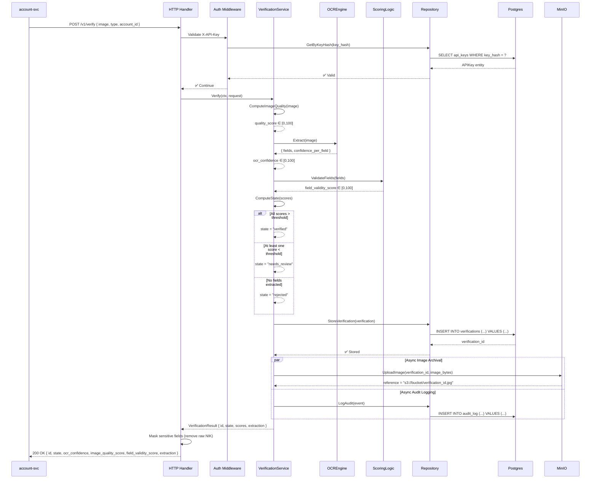
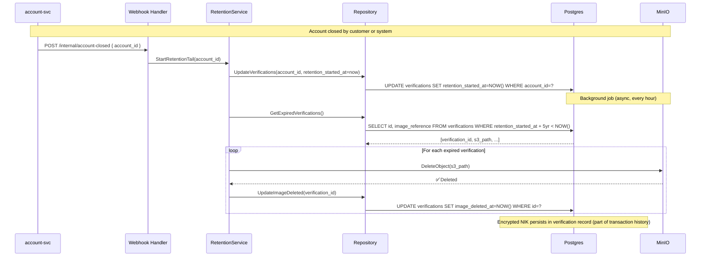

# kyc-svc — Architecture

## High-Level Architecture Diagram

```mermaid
graph TD
    AccountSvc["account-svc<br/>(port 8081)<br/>HTTP caller"]
    KycSvc["<b>kyc-svc</b><br/>(port 8084)<br/>Verification engine"]
    OcrTesseract["Tesseract<br/>(cgo, in-process)"]
    OcrSidecar["Python Sidecar<br/>(Flask/FastAPI)<br/>PaddleOCR/docTR"]
    Postgres["Postgres<br/>banking_kyc<br/>Verification records<br/>API keys<br/>Audit log"]
    MinIO["MinIO<br/>(S3-compatible)<br/>KTP images<br/>Encrypted storage"]
    
    AccountSvc -->|POST /v1/verify<br/>X-API-Key| KycSvc
    KycSvc -->|calls (pluggable)| OcrTesseract
    KycSvc -->|calls (if selected)| OcrSidecar
    KycSvc -->|CRUD + audit| Postgres
    KycSvc -->|archive image<br/>retrieve on retention| MinIO
    
    AccountSvc -->|account closure<br/>webhook/NATS| KycSvc
    
    style KycSvc fill:#4a90e2
    style Postgres fill:#52c41a
    style MinIO fill:#faad14
```

---

## Service Architecture

### Layering Model

```
┌─────────────────────────────────────────────────┐
│ Transport (HTTP handlers, middleware)           │
│ - POST /v1/verify                               │
│ - POST /internal/account-closed (webhook)       │
│ - GET /healthz/live, /healthz/ready             │
└────────────────┬────────────────────────────────┘
                 │ Context + Request
┌────────────────▼────────────────────────────────┐
│ Service layer (business logic)                  │
│ - VerificationService (verify, score)           │
│ - RetentionService (tail countdown, cleanup)    │
│ - APIKeyService (generate, validate)            │
│ - AuditService (log requests + results)         │
└────────────────┬────────────────────────────────┘
                 │ Interface calls
┌────────────────▼────────────────────────────────┐
│ Repository layer (data access)                  │
│ - VerificationRepository (CRUD)                 │
│ - APIKeyRepository (lookup, cache)              │
│ - AuditLogRepository (append-only)              │
└────────────────┬────────────────────────────────┘
                 │ SQL
┌────────────────▼────────────────────────────────┐
│ Persistence (Postgres + MinIO)                  │
│ - banking_kyc schema (3 tables)                 │
│ - MinIO S3 bucket for images                    │
└─────────────────────────────────────────────────┘
```

**Rules:**
- Transport never contains business logic (scoring, validation rules).
- Service layer contains all verification scoring + retention logic.
- Repository is the only layer that knows about Postgres schema or MinIO API.
- DAO structs are simple value types; logic lives in service + repository.

---

## Component Architecture

```
kyc-svc/
├── internal/
│   ├── transport/
│   │   ├── handlers.go              # HTTP handler funcs
│   │   ├── middleware.go            # Auth, logging, tracing
│   │   └── dto.go                   # Request/response shapes
│   │
│   ├── service/
│   │   ├── verification_service.go  # Verify, score (OCR + validity + image quality)
│   │   ├── retention_service.go     # Tail countdown, image deletion
│   │   ├── apikey_service.go        # Issue, validate keys
│   │   ├── audit_service.go         # Log events to audit_log table
│   │   └── ocr_engine.go            # OCREngine interface (pluggable)
│   │
│   ├── repository/
│   │   ├── verification_repo.go     # Insert/Update/GetByID/GetByAccountID
│   │   ├── apikey_repo.go           # Store API keys, validate against hash
│   │   └── audit_log_repo.go        # Append-only audit trail
│   │
│   ├── dao/
│   │   ├── verification.go          # DAO struct for verifications table
│   │   ├── api_key.go               # DAO struct for api_keys table
│   │   └── audit_log.go             # DAO struct for audit_log table
│   │
│   ├── infra/
│   │   ├── postgres/
│   │   │   ├── verification_repo.go     # PostgresVerificationRepository
│   │   │   ├── apikey_repo.go           # PostgresAPIKeyRepository
│   │   │   └── audit_log_repo.go        # PostgresAuditLogRepository
│   │   │
│   │   ├── minio/
│   │   │   └── image_store.go           # MinIO image archive/retrieve
│   │   │
│   │   └── ocr/
│   │       ├── tesseract.go             # Tesseract via gosseract
│   │       └── sidecar.go               # HTTP client to Python sidecar
│   │
│   ├── middleware/
│   │   ├── auth.go                  # X-API-Key validation
│   │   ├── logging.go               # Structured slog output
│   │   └── tracing.go               # Jaeger span injection
│   │
│   └── container.go                 # DI: wire all repos/services
│
├── migrations/
│   ├── 001_create_verifications.up.sql
│   ├── 002_create_api_keys.up.sql
│   └── 003_create_audit_log.up.sql
│
├── cmd/
│   └── main.go
│
└── tests/
    └── unit/                        # (future)
```

---

## Package Structure & Purpose

| Path | Purpose |
|---|---|
| `internal/transport` | HTTP entry point; handlers receive request, call service, return response. No business logic. |
| `internal/service` | Verification logic, scoring rules, retention countdown, audit logging. Depends on repository interfaces. |
| `internal/repository` | Interfaces for data access. Implementations in `infra/`. |
| `internal/dao` | Simple value structs (no methods); database column mappings only. |
| `internal/infra/postgres` | Postgres implementation of repository interfaces; SQL queries. |
| `internal/infra/minio` | MinIO S3 client; image archive/retrieve/delete. |
| `internal/infra/ocr` | OCREngine implementations: Tesseract (cgo), HTTP sidecar client. |
| `internal/middleware` | Auth (API key validation), logging, tracing. Shared across handlers. |
| `migrations/` | SQL DDL for 3 tables; versioned migrations. |
| `cmd/` | Entrypoint; wires container, starts HTTP server. |

---

## Request Lifecycle (Happy Path)

### Verification Request Flow



### Account Closure Flow (Retention Tail)



---

## Data Flow & Decision Trees

### Verification Outcome Decision Tree

```
Input: image_quality_score, ocr_confidence, field_validity_score
Thresholds: image_quality >= 60, ocr_confidence >= 70 (per field), field_validity >= 80

┌─ OCR failed? (no fields extracted)
│  └─ state = "rejected"
├─ All scores > threshold?
│  ├─ YES → state = "verified"
│  └─ NO → state = "needs_review"
└─ Return: { state, ocr_confidence, image_quality_score, field_validity_score, extraction }

Note: Thresholds are NOT applied by kyc-svc. Service returns all three scores; caller (account-svc)
decides pass/fail based on custom policy. kyc-svc only flags "needs_review" when scores suggest
ambiguity, not as a hard gate.
```

### OCR Engine Selection (Benchmark → Production)

```
Offline Benchmark (non-production, run by platform team):
  ├─ Load labeled KTP dataset (100+ images with ground truth)
  ├─ Evaluate candidate engines (Tesseract/Go, PaddleOCR/Python, docTR/Python, Keras-OCR/Python, etc.)
  ├─ Measure accuracy (F1, precision, recall per field) for each engine
  ├─ **Select ONE winner based on accuracy** (ignore tech stack preference)
  └─ Configure SELECTED_OCR_ENGINE in production .env

Production Deployment:
  ├─ If winner is Tesseract (Go):
  │  └─ kyc-svc uses Tesseract (cgo, in-process, no sidecar)
  ├─ If winner is PaddleOCR/docTR (Python):
  │  └─ Deploy Python sidecar in docker-compose.yml; kyc-svc calls via HTTP
  └─ If winner is other (Java, etc.):
     └─ Deploy sidecar/microservice accordingly

Note: Only ONE engine in production. No fallback/degradation to second-choice engine.
Accuracy > operational simplicity.
```

### Image Retention Lifecycle

```
Account created:
  └─ verification.created_at = NOW()
     verification.image_reference = "s3://bucket/verification_id.jpg"
     verification.retention_started_at = NULL

Verification stored:
  └─ Image archived in MinIO (immutable)

Account remains open:
  └─ Retain image indefinitely

Account closed (closure signal from account-svc):
  └─ verification.retention_started_at = NOW()
     (1-day to 5-year wait before deletion)

5 years after closure:
  └─ Background job deletes image from MinIO
     verification.image_deleted_at = NOW()

Encrypted NIK persists in database:
  └─ Part of verification record history; retained per standard DB retention policy
```

### API Key Cache Invalidation

```
API key lookup flow:
  1. Request arrives with X-API-Key header
  2. Hash key (SHA-256)
  3. Check in-memory cache: `apikey:{hash}` TTL 5 min
     ├─ CACHE HIT → return cached identity, continue
     └─ CACHE MISS → fall through to step 4
  4. Query Postgres: SELECT * FROM api_keys WHERE key_hash = ?
     ├─ FOUND → cache result (TTL 5 min), return identity
     └─ NOT FOUND → reject request (401)

Invalidation:
  - On key revocation: delete from DB, invalidate cache entry immediately
  - Cache TTL expiry: natural 5-min expiry, re-fetched on next request
```

---

## Storage Design

### Postgres Schema (banking_kyc database)

#### Table: verifications

```sql
CREATE TABLE verifications (
    id UUID PRIMARY KEY DEFAULT gen_random_uuid(),
    account_id TEXT NOT NULL,
    verification_type TEXT NOT NULL CHECK (verification_type IN ('ktp_ocr')),
    
    -- Scores (0-100 or NULL if not computed)
    ocr_confidence DECIMAL(5,2),
    image_quality_score DECIMAL(5,2),
    field_validity_score DECIMAL(5,2),
    
    -- Outcome state
    state TEXT NOT NULL CHECK (state IN ('processing', 'verified', 'needs_review', 'rejected')),
    
    -- PII storage (platform handles encryption at Postgres level)
    nik TEXT,                         -- plaintext NIK; Postgres column-level encryption handles security
    image_reference TEXT,             -- S3 path: "s3://bucket/verification_id.jpg"
    
    -- Extraction (full structured data, plaintext; fields >= 9 for v1)
    extraction JSONB,                 -- { "nik": "1234567890123456", "nama": "...", "dob": "1990-01-01", ... }
    
    -- Retention lifecycle
    retention_started_at TIMESTAMP,   -- NULL until account closed; then NOW()
    image_deleted_at TIMESTAMP,       -- NULL until expiry; then NOW()
    
    -- Audit trail
    created_at TIMESTAMP NOT NULL DEFAULT NOW(),
    updated_at TIMESTAMP NOT NULL DEFAULT NOW(),
    
    INDEX idx_account_id (account_id, created_at),  -- for retention queries
    INDEX idx_state (state),
    INDEX idx_created_at (created_at)
);
```

**Note:** `nik` column is plaintext in the application layer. Postgres column-level encryption (or similar platform infrastructure) ensures it's encrypted at rest; kyc-svc does not encrypt/decrypt.

#### Table: api_keys

```sql
CREATE TABLE api_keys (
    id UUID PRIMARY KEY DEFAULT gen_random_uuid(),
    service TEXT NOT NULL,  -- e.g., "account-svc"
    key_prefix TEXT NOT NULL,  -- first 8 chars of plaintext key, for logging
    key_hash BYTEA NOT NULL UNIQUE,  -- SHA-256 hash (raw, not hex)
    
    is_active BOOLEAN NOT NULL DEFAULT true,
    is_revoked BOOLEAN NOT NULL DEFAULT false,
    
    created_at TIMESTAMP NOT NULL DEFAULT NOW(),
    revoked_at TIMESTAMP,
    
    INDEX idx_service (service),
    INDEX idx_active (is_active)
);
```

#### Table: audit_log

```sql
CREATE TABLE audit_log (
    id BIGSERIAL PRIMARY KEY,
    
    -- Request metadata
    requester TEXT NOT NULL,  -- API key holder / service name
    verification_id UUID NOT NULL REFERENCES verifications(id),
    account_id TEXT NOT NULL,
    
    -- Result summary (never log raw fields/NIK)
    verification_type TEXT NOT NULL,
    state TEXT NOT NULL,
    ocr_confidence DECIMAL(5,2),
    image_quality_score DECIMAL(5,2),
    field_validity_score DECIMAL(5,2),
    
    -- Event metadata
    action TEXT NOT NULL,  -- "verification_requested", "verification_completed", "image_deleted", etc.
    timestamp TIMESTAMP NOT NULL DEFAULT NOW(),
    
    INDEX idx_account_id (account_id, timestamp),
    INDEX idx_verification_id (verification_id),
    INDEX idx_action (action, timestamp)
);
```

### MinIO Object Storage

**Bucket:** `kyc-verifications` (created by ops, never by service)

**Object Key Pattern:** 
```
s3://kyc-verifications/verification/{verification_id}/image.jpg
```

**Server-Side Encryption:** Enabled on bucket (ops responsibility)

**Retention:** Managed by kyc-svc background job (not MinIO lifecycle policy); service deletes after 5-year tail.

**No Caching:** Images are write-once, retrieve-once (for retention check), then delete. No cache layer needed.

---

## API Design

### POST /v1/verify

**Authentication:** X-API-Key header (required)

**Request:**
```json
{
  "image": "base64-encoded-jpeg-or-png",
  "type": "ktp_ocr",
  "account_id": "550e8400-e29b-41d4-a716-446655440000"
}
```

**Response (200 OK):**
```json
{
  "id": "verification-uuid",
  "state": "verified",
  "ocr_confidence": 92.5,
  "image_quality_score": 88.0,
  "field_validity_score": 95.0,
  "extraction": {
    "nik": "ENCRYPTED_REFERENCE_ONLY_NOT_RETURNED",
    "nama": "John Doe",
    "tempat_lahir": "Jakarta",
    "tgl_lahir": "1990-01-01",
    "jenis_kelamin": "M",
    "alamat_rt_rw": "001/002",
    "alamat_kel_desa": "Ciganjur",
    "alamat_kecamatan": "Jagakarsa",
    "agama": "Islam",
    "status_perkawinan": "Married",
    "kewarganegaraan": "WNI",
    "berlaku_hingga": "2030-12-31"
  }
}
```

**Error Responses:**

| Status | Code | Scenario |
|---|---|---|
| **400** | `INVALID_IMAGE_FORMAT` | Image is not JPEG/PNG, or too small (< 200×200px) |
| **400** | `IMAGE_NOT_KTP` | Image is not a readable KTP (doesn't look like ID card) |
| **401** | `UNAUTHORIZED` | Missing or invalid X-API-Key |
| **422** | `UNPROCESSABLE_ENTITY` | Invalid account_id format, or account_id not found (if validated upstream) |
| **429** | `RATE_LIMITED` | API key exceeded 100 req/min |
| **500** | `INTERNAL_ERROR` | Database error, MinIO unavailable, OCR engine crash (with retryable flag) |

**Rate Limit Headers:**
```
X-RateLimit-Limit: 100
X-RateLimit-Remaining: 87
X-RateLimit-Reset: 1689177660
```

---

### POST /internal/account-closed (Webhook)

**Authentication:** Internal only (IP allowlist or shared secret — TODO: secure this, see Pending)

**Request:**
```json
{
  "account_id": "550e8400-e29b-41d4-a716-446655440000",
  "closed_at": "2026-07-14T10:30:00Z"
}
```

**Response (204 No Content)**

**Notes:**
- Idempotent (can be called multiple times for same account_id, no duplicate tails started)
- Async job processes the closure; response returns before deletion begins
- No error response if account_id not found (graceful, already processed or doesn't exist in kyc-svc)

---

### GET /healthz/live

**Response (200 OK):**
```json
{
  "status": "live"
}
```

**Notes:** Service is responding; not a readiness check.

---

### GET /healthz/ready

**Response (200 OK):**
```json
{
  "status": "ready",
  "database": "connected",
  "minio": "connected",
  "ocr_engine": "healthy"
}
```

**Response (503 Service Unavailable):** If database unreachable, MinIO bucket not writable, or OCR engine unavailable (and no fallback available).

---

## Integration Patterns

### Outbound: Postgres (CRUD Verifications, API Keys, Audit Log)

- **Driver:** `pgx` (prepared statements, connection pooling)
- **Transactions:** Serializable isolation for verification + audit log (atomic)
- **Retries:** 3 attempts with exponential backoff (100ms, 250ms, 500ms) on transient errors (DEADLOCK, connection reset)
- **Connection pooling:** Max 10 connections (tunable via `DB_POOL_SIZE`)

### Outbound: MinIO (Archive/Retrieve Images)

- **Client:** AWS S3 SDK (minio-go compatible)
- **Upload:** Fire-and-forget async; don't block verification response. Log failures, alert on repeated failures.
- **Retrieve:** Blocking call (only during retention countdown check; rare). Timeout 5s.
- **Delete:** Blocking call. Timeout 10s. Retry 3x on transient error.
- **Fallback:** If MinIO unavailable on /v1/verify, skip image upload, flag verification with `image_archived=false`, log warning. Verification still succeeds (image is optional for decision). Later retry async.

### Outbound: OCR Engine (Benchmark-Selected)

**One engine only** (selected via offline benchmark; language/platform determined by accuracy).

#### If Tesseract (Go, in-process)

- **Library:** `github.com/otiai10/gosseract` (cgo bindings)
- **Timeout:** 10s per image
- **Failure:** If Tesseract fails, return `state = "rejected"`. No fallback.

#### If PaddleOCR/docTR (Python, sidecar HTTP)

- **Protocol:** HTTP POST to `http://ocr-sidecar:8000/extract` (Docker network, stable hostname)
- **Timeout:** 15s
- **Failure:** If sidecar unreachable after 3 retries, return `state = "rejected"`. No fallback (accuracy was reason for selection).
- **Payload:** `{ "image_base64": "...", "type": "ktp_ocr" }`
- **Response:** `{ "fields": { "nik": "...", ... }, "confidence": { "nik": 0.95, ... } }`

#### If Other Engine (Java, etc.)

- **Deployment:** Follow same pattern as Python sidecar (containerized, HTTP or gRPC interface, docker-compose.yml includes service)
- **kyc-svc:** Calls via stable interface (in-process or remote)
- **Failure mode:** Same as above (no fallback; accuracy was reason for selection)

### Inbound: Account-svc Notifications

- **Trigger:** Account closed (immediate) or account marked for deletion (after grace period)
- **Pattern:** Webhook HTTP POST (see `/internal/account-closed` above) or NATS subscription (TBD; consider for later)
- **Reliability:** Idempotent (can retry without creating duplicate tails)
- **Retry:** account-svc retries webhook if kyc-svc returns 5xx (exponential backoff, max 5 attempts)

---

## Security Design

### Authentication Mechanism

| Mechanism | Used For | Details |
|---|---|---|
| **X-API-Key** | /v1/verify | Service-to-service (account-svc). Key format: `bp_kyc_<32 base62>`. Issued by kyc-svc only; no auth-svc dependency. Validated in middleware; hash-lookup in database + in-memory cache (5-min TTL). |
| **(Future) Shared Secret** | /internal/account-closed | Webhook authentication. Static header (e.g., `X-Internal-Token`) or HMAC-SHA256 signature. **TODO: implement before production.** |

### Threat Model & Mitigations

| Threat | Impact | Mitigation |
|---|---|---|
| **Unauthorized verification** | Attacker submits forged KTP images posing as account-svc | API key validation (X-API-Key + cache-aside lookup). Only account-svc has valid key. |
| **Key theft** | Attacker uses leaked API key to spam verifications | Rate limiting (100 req/min per key). Revoke key immediately if suspected compromise. Audit log tracks all requests. |
| **Plaintext NIK in logs** | Compliance breach if NIK logged | Structured slog output never includes extracted fields. Code review to ensure no `fmt.Printf` of sensitive data. |
| **Unencrypted NIK in DB** | Database breach exposes all NIKs | Platform infrastructure (Postgres column-level encryption or similar) ensures NIK encrypted at rest. kyc-svc reads/writes as plaintext; platform handles encryption transparently. |
| **Image stored in BYTEA** | Database bloat + backup bloat | MinIO S3 archival instead. Scales independently. |
| **Image persists forever** | Compliance risk (PII retention) | Retention policy tied to account lifecycle + 5-year tail. Automated cleanup job. |
| **OCR engine compromise (if sidecar)** | RCE if sidecar is compromised | Sidecar runs in isolated container (banking-net only, no internet). Tightly scoped HTTP API. No fallback (accuracy was selection criterion). |
| **Webhook impersonation** | Attacker closes accounts falsely, deletes images prematurely | Shared secret or HMAC signature on /internal/account-closed. IP allowlist (Docker internal network). **TODO: harden.** |
| **Cross-service key reuse** | API key for kyc-svc used to call other services | Keys are service-specific. kyc-svc key only valid for kyc-svc endpoints. No cross-service key sharing. |

### Authorization Model

| Role | Capability |
|---|---|
| **account-svc** (via API key) | POST /v1/verify (submit verifications for account IDs it owns) |
| **Internal webhook caller** (via shared secret) | POST /internal/account-closed |
| **None** (no user-facing auth) | kyc-svc is service-to-service only. No UI, no end-user accounts. |

### RBAC (Coarse-Grained)

Not applicable (service-to-service only). If future external product variant is built, implement fine-grained RBAC at that time.

---

## Observability Design

### Logging

**Structured Logging:** All output via `slog.InfoContext`, `slog.WarnContext`, `slog.ErrorContext` (never `fmt.Println`).

| Level | Event | Fields |
|---|---|---|
| **INFO** | Verification request received | verification_id, account_id, verification_type |
| **INFO** | Verification completed | verification_id, state, ocr_confidence, image_quality_score, field_validity_score |
| **WARN** | Score below threshold | verification_id, state = "needs_review", which_score |
| **WARN** | Image archival failed (will retry async) | verification_id, error (no sensitive details) |
| **WARN** | OCR engine degraded (fallback active) | verification_id, fallback_engine |
| **ERROR** | Database error | error, query context (no PII) |
| **ERROR** | Verification failed (unrecoverable) | verification_id, reason (e.g., OCR timeout) |

**Redaction:** Logs NEVER include `extraction`, `nik`, raw `image`, or base64 data. Only numeric scores and state strings.

### Metrics (Prometheus)

| Metric | Type | Labels | Purpose |
|---|---|---|---|
| `kyc_verification_latency_seconds` | Histogram | `type`, `state`, `engine` | End-to-end verification time. Buckets: [0.1, 0.5, 1, 2, 3, 5, 10] |
| `kyc_ocr_confidence` | Histogram | `type`, `field` | Per-field OCR confidence. Buckets: [0.0, 0.2, 0.4, 0.6, 0.8, 1.0] |
| `kyc_image_quality_score` | Histogram | `type` | Image quality before OCR. Buckets: [0, 20, 40, 60, 80, 100] |
| `kyc_field_validity_score` | Histogram | `type` | Field validity after OCR. Buckets: [0, 20, 40, 60, 80, 100] |
| `kyc_verification_state_total` | Counter | `type`, `state` | Total verifications by state. |
| `kyc_apikey_validation_latency_seconds` | Histogram | `cache_hit` | Key lookup time (cache vs. DB). |
| `kyc_minio_upload_latency_seconds` | Histogram | `success` | Image archival latency. |
| `kyc_ocr_engine_call_latency_seconds` | Histogram | `engine`, `success` | OCR engine call time (Tesseract or sidecar). |
| `kyc_audit_log_latency_seconds` | Histogram | (none) | Audit log write time. |
| `kyc_retention_job_run_total` | Counter | `status` | Background retention job runs (success/failure). |
| `kyc_retention_images_deleted_total` | Counter | (none) | Cumulative images deleted by retention job. |

### Tracing (Jaeger)

| Operation | Span Name | Attributes |
|---|---|---|
| Full request | `POST /v1/verify` | verification_id, account_id, verification_type, state (at end) |
| Image quality scoring | `compute_image_quality` | image_size, image_quality_score |
| OCR extraction | `ocr_extract` | engine (tesseract/sidecar), ocr_confidence, field_count |
| Field validation | `validate_fields` | field_validity_score |
| DB insert | `db_insert_verification` | query_type (INSERT), rows_affected |
| MinIO upload | `minio_upload` | object_key, size_bytes, success |
| Audit log write | `audit_log_write` | action, requester |
| Account closure processing | `process_account_closed` | account_id, verification_count, rows_updated |

**No sensitive data in attributes.** (No extracted fields, no raw image, no NIK.)

### Health Checks

**GET /healthz/live:** Returns 200 OK if service is running (TCP socket can connect). No dependency checks.

**GET /healthz/ready:** Returns 200 OK if all dependencies are healthy:
- Postgres: execute `SELECT 1` (< 100ms)
- MinIO: `HeadBucket()` call (< 500ms)
- OCR engine: 
  - If Tesseract: library loaded (cgo init check)
  - If sidecar: HTTP GET /health on sidecar endpoint (< 1s)

Returns 503 if any dependency fails. Readiness gate: `service.register.enabled: readinessgates: [healthz_ready]` in Kubernetes (or Docker health check).

---

## Scalability Considerations

### Horizontal Scaling

**Stateless:** kyc-svc is fully stateless (no in-memory session data, no sticky routing). API key cache is local but backed by database; natural TTL invalidation + background refresh.

**Deployment:** Run multiple replicas (2–N) behind a load balancer. Each replica connects to shared Postgres + MinIO.

**Bottleneck:** Postgres connection pool. Set `DB_POOL_SIZE` to 5–10 per replica (tunable). Total connections = replicas × pool_size. At 10 replicas with pool_size=5, that's 50 connections. Postgres default max is 100; acceptable.

### Database Scalability

**Single Postgres instance** (shared with auth-svc, account-svc). kyc-svc tables are small:
- `verifications`: 1–100 rows per account. Index on (account_id, created_at) for retention queries. Expected size < 100GB after 5 years (billions of verifications).
- `api_keys`: < 100 rows (one per service or customer).
- `audit_log`: Append-only. ~1KB per row. 100 req/sec = 8.6GB/year. Index on (account_id, timestamp) for queries.

**Future optimization:** If retention queries slow down (millions of expired records), partition `verifications` by account_id and create materialized view for retention candidates.

### Image Storage Scalability

**MinIO S3:** Scales horizontally (add drives/nodes). Assumed ops manages sizing. kyc-svc just uploads/downloads/deletes. No caching, no replication logic at app level.

**Expected throughput:** 100 verifications/sec = 100 image uploads/sec (async, non-blocking). Typical KTP image: 200KB. Total: 20MB/sec write. MinIO can handle easily.

### OCR Engine Scalability

**Tesseract (in-process):** Limited by CPU core count. At 100 req/sec on 2-core container, expect queue buildup. Mitigation: scale kyc-svc replicas (each gets its own Tesseract instance).

**Python sidecar:** Also CPU-bound. Can run separate replicas of sidecar container behind load balancer. kyc-svc calls via hostname that load-balances (e.g., `ocr-sidecar.banking-net:8000`).

---

## Reliability Considerations

### Failure Modes & Recovery

| Component | Failure Scenario | Impact | Mitigation |
|---|---|---|---|
| **Postgres** | Connection timeout | POST /v1/verify returns 500; new verifications blocked | Retry 3x with backoff. Health check gate readiness. Failover handled by platform RDS/Patroni. |
| **Postgres** | Constraint violation (duplicate nik_encrypted) | Unlikely, but would return 500 | Investigate root cause. Log error, don't retry. |
| **MinIO** | Upload timeout | Image not archived; verification still succeeds (marked image_archived=false) | Async retry job re-attempts upload every 5 min. If persistent, alert ops. |
| **MinIO** | Bucket not found | Readiness check fails (503); service unhealthy | Ops creates bucket before deployment. Create-on-startup check in container init. |
| **OCR engine (Tesseract)** | cgo panic / Out of memory | POST /v1/verify crashes (503) | Timeout enforced (10s); if exceeded, assume failed. Circuit breaker (2 failures → open) → fallback or reject. |
| **OCR engine (Sidecar)** | Container unreachable | HTTP timeout (15s) → retry 3x → fall back to Tesseract | kyc-svc health check includes sidecar reachability; readiness gate fails if sidecar down and no fallback. |
| **Account closure webhook** | kyc-svc unreachable when account-svc tries to notify | account-svc retries (exponential backoff, 5 attempts) | After retries exhausted, account-svc logs failure. Manual cleanup (query kyc-svc and retry). |
| **API key cache** | Cache key expires while request in flight | Cache miss → DB lookup (slower, but correct) | Acceptable. Cache hit rate > 99% expected (same key used repeatedly). |
| **Rate limit counter** | In-memory counter lost on restart | Rate limit resets after restart (brief spike possible) | Acceptable trade-off (in-memory counter is simple + performant; DB-backed counter adds latency). |

### Circuit Breaker Pattern

**OCR Engine Fallback:**
```
State: CLOSED (normal)
  ├─ 2 consecutive failures → OPEN
  │  └─ Fall back to Tesseract (if not already Tesseract)
  └─ Otherwise, return 503
     
State: OPEN
  ├─ 60s cooldown expires → HALF-OPEN
  │  └─ Allow 1 test request
  │     ├─ Success → CLOSED (recovery)
  │     └─ Failure → OPEN (cooldown resets)
```

### Graceful Degradation

- **MinIO unavailable:** Continue verification, skip image upload, log warning. Async retry later.
- **Sidecar unavailable:** Fall back to Tesseract (or vice versa if Tesseract is fallback).
- **Rate limit exceeded:** Return 429 with Retry-After header; caller backs off.
- **Database degraded:** Health check returns 503; requests queued until recovery.

---

## Architecture Traceability to Goals

| Goal ID | Architectural Component | Rationale |
|---|---|---|
| **BO-01** | Verification service + OCR engine abstraction | Enables identity verification as foundational KYC capability. |
| **BO-02** | Pluggable OCR engine interface + verification_type enum (currently "ktp_ocr") | Allows new verification types without architectural changes. |
| **BO-03** | `audit_log` table (append-only, 7-year retention index) | Complete audit trail for compliance. Owned by kyc-svc, not shared with audit-svc. |
| **BO-04** | Self-contained auth (API keys, not auth-svc) + own audit log | Can extract to standalone product; no auth-svc or audit-svc dependency. |
| **BO-05** | `nik_encrypted` (pkg/crypto) + MinIO archival + retention_started_at + background deletion job | PII encrypted, archived remotely, automatically cleaned up. |
| **FR-01** | POST /v1/verify endpoint, image base64 input validation | Accept KTP image upload. |
| **FR-02** | `extraction` JSONB column + OCR engine integration | Extract and return structured fields. |
| **FR-03** | `image_quality_score` computed before OCR | Image quality as separate score. |
| **FR-04** | `ocr_confidence` per field from OCR engine | Report OCR confidence unmodified. |
| **FR-05** | `field_validity_score` computed by business rules in verification service | Validate fields independent of OCR engine. |
| **FR-06** | `state` column (enum: processing/verified/needs_review/rejected) | Emit verification state. |
| **FR-07** | Response JSON includes all three scores (never collapsed) | Always return scores; caller decides thresholds. |
| **FR-08** | INSERT INTO verifications; indexed by account_id | Persist and retrieve verifications. |
| **FR-09** | `nik_encrypted` BYTEA column, encryption/decryption in repository layer | Encrypt NIK at rest. |
| **FR-10** | MinIO S3 archival, `image_reference` column | Archive image remotely. |
| **FR-11** | `retention_started_at` timestamp, background deletion job after 5y | Tie retention to account lifecycle. |
| **FR-12** | Background job queries verifications with `retention_started_at + 5y < NOW()`, deletes from MinIO | Automated cleanup. |
| **FR-13** | Structured logging (slog only, redaction in middleware) | No sensitive data in logs. |
| **FR-14** | `api_keys` table, X-API-Key validation in middleware, cache-aside lookup | Issue and validate service API keys. |
| **FR-15** | POST /v1/verify handler, request/response DTO | Accept verification requests. |
| **FR-16** | Error responses via `httpx.WriteError`, status codes mapped in middleware | Structured error responses. |
| **FR-17** | POST /internal/account-closed webhook handler, idempotent processing | Consume account closure signals. |
| **FR-18** | Offline benchmark harness (non-production utility) | Compare OCR engines. |
| **FR-19** | `OCREngine` interface, `TesseractImpl`, `SidecarImpl` | Pluggable engines. |
| **NFR-01, NFR-02** | Latency instrumentation (Prometheus histogram); P50 < 1s design goal | Performance metrics. |
| **NFR-05, NFR-06** | Health checks, Postgres failover (RDS/Patroni), readiness gate | Availability. |
| **NFR-09, NFR-10** | Encryption at rest, X-API-Key auth, rate limiting | Security. |
| **NFR-15, NFR-16, NFR-17** | Structured logging, Prometheus metrics, Jaeger tracing | Observability. |
| **NFR-19, NFR-20, NFR-21** | Stateless design, connection pooling, MinIO scalability | Scalability. |

---

## Future Enhancements (Out of Scope v1)

- [ ] **External KYC provider integration** — APIs to third-party services (Clearview, Idemia, etc.)
- [ ] **Facial recognition verification type** — new verification_type = "facial_recognition"
- [ ] **Address verification** — integrate with postal service API
- [ ] **Distributed rate limiting** — Redis-backed rate limit instead of in-memory (for multi-replica deployments)
- [ ] **Database-backed audit log** — move from append-only table to dedicated audit service (if compliance requires longer retention)
- [ ] **Sidecar auto-deployment** — Helm chart to manage Python sidecar alongside kyc-svc
- [ ] **Webhook signature verification** — HMAC-SHA256 or RSA signatures on account closure webhook
- [ ] **GraphQL API** — alternative to REST for verification queries

---

## Architecture Decision Record

See `docs/adr/` for detailed design rationale:
- **ADR-0001:** Self-contained auth + audit (API keys, own database)
- **ADR-0002:** MinIO + PII encryption + retention policy
- **ADR-0003:** Pluggable OCR engines (Tesseract + Python sidecar)