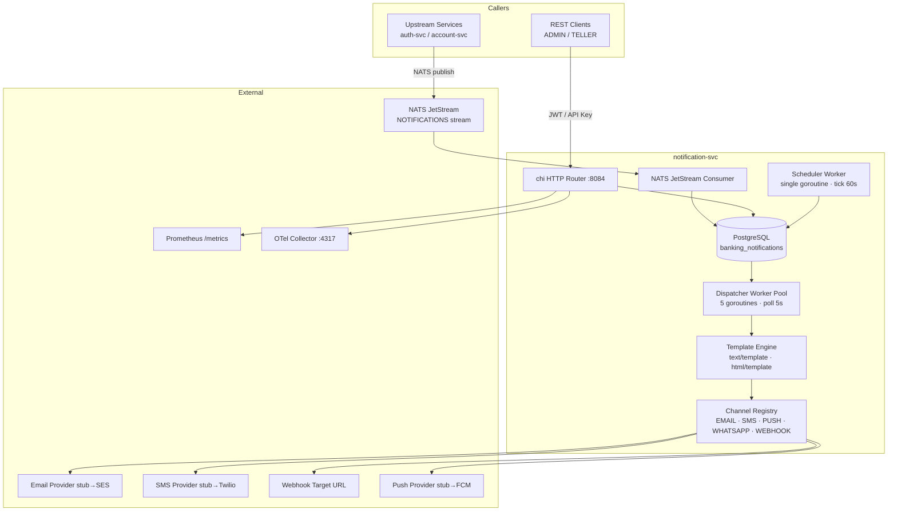
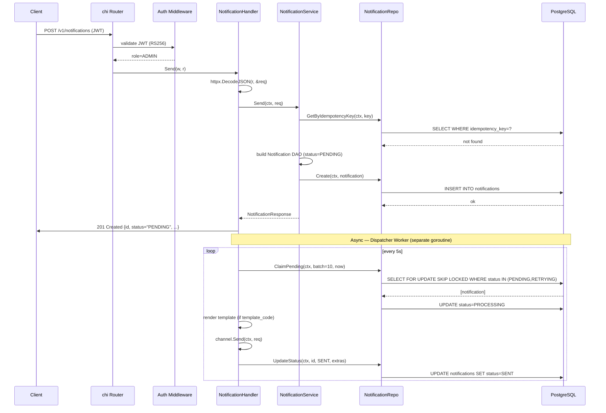

# architecture.md — notification-svc

> Technical design. Every decision traces to a requirement or constraint in goals.md.

---

## High-Level Architecture



---

## Service Architecture — Layering

```
Transport (chi handlers)
      ↓
Services (business logic, idempotency, template rendering, status transitions)
      ↓
Repository (interface — abstracts DB calls)
      ↓
DAO (GORM structs — maps directly to DB tables)
```

Rules:
- Handlers are thin: parse → call service → write response.
- Services own all business rules, status machine, idempotency logic.
- Repositories own all SQL; services never write raw SQL.
- Workers (Dispatcher, Scheduler, NATS Consumer) call service-layer methods, not repositories directly.
- `pkg/` is shared and never imports any service package.

---

## Component Architecture

| Component | Package | Purpose |
|---|---|---|
| Entry point | `cmd/server/main.go` | Wire container, start HTTP server, block on signal |
| DI container | `internal/container.go` | Construct all dependencies; own lifecycle (connect, close) |
| Config | `config/config.go` | Load env vars with defaults; validate required fields |
| HTTP transport | `internal/transport/` | chi router setup, all handlers, middleware wiring |
| Notification handler | `transport/notification_handler.go` | POST, GET, list, retry, cancel |
| Template handler | `transport/template_handler.go` | CRUD, preview |
| Schedule handler | `transport/schedule_handler.go` | CRUD, enable, disable |
| Health handler | `transport/health_handler.go` | /healthz/live, /healthz/ready |
| Notification service | `internal/services/notification_service.go` | Send, Retry, Cancel, GetByID, List |
| Template service | `internal/services/template_service.go` | Create, Update, Delete, GetByID, GetByCode, List, Preview |
| Schedule service | `internal/services/schedule_service.go` | Create, Update, Delete, GetByID, List, Enable, Disable |
| Notification repo | `internal/repository/notification_repository.go` | CRUD + ClaimPending + idempotency lookup |
| Template repo | `internal/repository/template_repository.go` | CRUD + GetByCode |
| Schedule repo | `internal/repository/schedule_repository.go` | CRUD + ClaimDue + UpdateAfterRun |
| Domain DAOs | `internal/domain/` | `Notification`, `Template`, `Schedule` GORM structs |
| Channel registry | `internal/channel/` | `Registry` map + `Channel` interface |
| Channel providers | `internal/channel/{email,sms,push,whatsapp,webhook}/` | Provider implementations |
| Template engine | `internal/template/` | Go template renderer for body + subject |
| Dispatcher worker | `internal/worker/dispatcher.go` | Poll → claim → render → send → update status |
| Scheduler worker | `internal/worker/scheduler.go` | Tick → claim due → fire → update next_run_at |
| NATS consumer | `internal/worker/nats_consumer.go` | Pull consumer → call notification service |

---

## Package Structure

```
notification-svc/
├── cmd/
│   └── server/
│       └── main.go              # entry point
├── config/
│   └── config.go                # env config struct
├── docs/                        # five mandatory docs (this file)
├── internal/
│   ├── container.go             # dependency injection container
│   ├── channel/                 # channel interface + registry
│   │   ├── channel.go           # Channel interface, Registry, SendResult
│   │   ├── email/               # EMAIL stub
│   │   ├── sms/                 # SMS stub
│   │   ├── push/                # PUSH stub
│   │   ├── whatsapp/            # WHATSAPP stub
│   │   └── webhook/             # WEBHOOK production-ready
│   ├── domain/                  # DAO structs (GORM models)
│   │   ├── notification.go
│   │   ├── template.go
│   │   └── schedule.go
│   ├── repository/              # data access layer
│   │   ├── notification_repository.go
│   │   ├── template_repository.go
│   │   └── schedule_repository.go
│   ├── services/                # business logic
│   │   ├── notification_service.go
│   │   ├── template_service.go
│   │   └── schedule_service.go
│   ├── template/                # Go template renderer
│   │   └── renderer.go
│   ├── transport/               # chi handlers + router wiring
│   │   ├── router.go
│   │   ├── notification_handler.go
│   │   ├── template_handler.go
│   │   ├── schedule_handler.go
│   │   └── health_handler.go
│   └── worker/                  # background goroutines
│       ├── dispatcher.go        # async delivery worker pool
│       ├── scheduler.go         # cron/one-time firing
│       └── nats_consumer.go     # NATS pull consumer
├── migrations/                  # embedded SQL migration files
│   ├── 000001_create_notifications.up.sql
│   ├── 000002_create_templates.up.sql
│   └── 000003_create_schedules.up.sql
├── Dockerfile
├── Makefile
├── go.mod
└── go.sum
```

---

## Request Lifecycle — Send Notification (Happy Path)



---

## Data Flow — Dispatcher Decision Tree

```
ClaimPending() → []Notification
  for each notification:
    if template_code present:
      TemplateRepo.GetByCode() → Template
      renderer.Render(template, vars) → body, subject
    else:
      use payload.body / payload.subject directly

    channel = Registry.Get(notification.channel)
    result, err = channel.Send(ctx, SendRequest)

    if err == nil:
      UpdateStatus(SENT, sent_at=now, provider_ref=result.ProviderRef)
      metrics: notification_sent_total{channel}++
    else:
      retry_count++
      if retry_count >= max_retries:
        UpdateStatus(FAILED, error_message=err)
        metrics: notification_failed_total{channel}++
      else:
        UpdateStatus(RETRYING, error_message=err)
        metrics: notification_retried_total{channel}++
```

---

## Storage Design

### Table: `notifications`

```sql
CREATE TABLE notifications (
    id               TEXT PRIMARY KEY,
    channel          TEXT NOT NULL,                 -- EMAIL|SMS|PUSH|WHATSAPP|WEBHOOK
    recipient        TEXT NOT NULL,
    template_id      TEXT,
    template_code    TEXT,
    template_vars    JSONB,
    payload          JSONB,
    status           TEXT NOT NULL DEFAULT 'PENDING',
    provider_ref     TEXT,
    provider_resp    JSONB,
    error_message    TEXT,
    retry_count      INT NOT NULL DEFAULT 0,
    max_retries      INT NOT NULL DEFAULT 3,
    idempotency_key  TEXT,
    schedule_id      TEXT,
    scheduled_at     TIMESTAMPTZ,
    sent_at          TIMESTAMPTZ,
    delivered_at     TIMESTAMPTZ,
    created_at       TIMESTAMPTZ NOT NULL DEFAULT NOW(),
    updated_at       TIMESTAMPTZ NOT NULL DEFAULT NOW()
);

-- Partial unique index for idempotency (nulls are ignored)
CREATE UNIQUE INDEX uq_notifications_idempotency_key
    ON notifications (idempotency_key)
    WHERE idempotency_key IS NOT NULL;

-- Dispatcher claim index
CREATE INDEX idx_notifications_claim
    ON notifications (status, scheduled_at)
    WHERE status IN ('PENDING', 'RETRYING');

-- List / filter indexes
CREATE INDEX idx_notifications_channel     ON notifications (channel);
CREATE INDEX idx_notifications_recipient   ON notifications (recipient);
CREATE INDEX idx_notifications_template_code ON notifications (template_code);
CREATE INDEX idx_notifications_schedule_id ON notifications (schedule_id);
CREATE INDEX idx_notifications_created_at  ON notifications (created_at DESC);
```

### Table: `templates`

```sql
CREATE TABLE templates (
    id         TEXT PRIMARY KEY,
    code       TEXT NOT NULL,              -- human-readable, e.g. "account_created"
    name       TEXT NOT NULL,
    channel    TEXT NOT NULL,
    format     TEXT NOT NULL DEFAULT 'TEXT', -- TEXT | HTML
    subject    TEXT,                       -- for EMAIL
    body       TEXT NOT NULL,             -- Go template syntax
    variables  JSONB,                     -- schema hint
    version    INT NOT NULL DEFAULT 1,    -- auto-incremented on update
    active     BOOLEAN NOT NULL DEFAULT TRUE,
    created_at TIMESTAMPTZ NOT NULL DEFAULT NOW(),
    updated_at TIMESTAMPTZ NOT NULL DEFAULT NOW()
);

CREATE INDEX idx_templates_code_active ON templates (code, active);
```

### Table: `schedules`

```sql
CREATE TABLE schedules (
    id             TEXT PRIMARY KEY,
    name           TEXT NOT NULL,
    description    TEXT,
    channel        TEXT NOT NULL,
    template_code  TEXT NOT NULL,
    recipient      TEXT NOT NULL,
    template_vars  JSONB,
    cron_expr      TEXT,                  -- 5-field standard cron; NULL for one-time
    scheduled_at   TIMESTAMPTZ,          -- NULL for recurring
    recurring      BOOLEAN NOT NULL DEFAULT FALSE,
    enabled        BOOLEAN NOT NULL DEFAULT TRUE,
    last_run_at    TIMESTAMPTZ,
    next_run_at    TIMESTAMPTZ,
    created_at     TIMESTAMPTZ NOT NULL DEFAULT NOW(),
    updated_at     TIMESTAMPTZ NOT NULL DEFAULT NOW(),

    CONSTRAINT chk_schedule_type CHECK (
        (recurring = TRUE AND cron_expr IS NOT NULL AND scheduled_at IS NULL) OR
        (recurring = FALSE AND scheduled_at IS NOT NULL AND cron_expr IS NULL)
    )
);

-- Scheduler claim index
CREATE INDEX idx_schedules_claim
    ON schedules (enabled, next_run_at)
    WHERE enabled = TRUE;
```

---

## API Design

All routes require `Authorization: Bearer <JWT>` unless marked **public**.

### Notifications

| Method | Path | Auth | Request | Response |
|---|---|---|---|---|
| POST | `/v1/notifications` | ADMIN, TELLER | `SendNotificationRequest` | 201 `NotificationResponse` |
| GET | `/v1/notifications` | ADMIN | query params | 200 `PaginatedNotificationsResponse` |
| GET | `/v1/notifications/{id}` | ADMIN, TELLER | — | 200 `NotificationResponse` |
| POST | `/v1/notifications/{id}/retry` | ADMIN | — | 200 `NotificationResponse` |
| POST | `/v1/notifications/{id}/cancel` | ADMIN, TELLER | — | 200 `NotificationResponse` |

`SendNotificationRequest`:
```json
{
  "channel":         "EMAIL",
  "recipient":       "user@example.com",
  "template_code":   "account_created",
  "template_vars":   { "name": "Alice" },
  "payload":         { "subject": "...", "body": "..." },
  "max_retries":     3,
  "idempotency_key": "evt-abc123",
  "scheduled_at":    "2026-01-01T09:00:00Z",
  "schedule_id":     "sched-uuid"
}
```

List query params: `status`, `channel`, `recipient`, `template_code`, `schedule_id`, `from` (RFC3339), `to` (RFC3339), `page`, `page_size` (max 100).

### Templates

| Method | Path | Auth | Request | Response |
|---|---|---|---|---|
| POST | `/v1/templates` | ADMIN | `CreateTemplateRequest` | 201 `TemplateResponse` |
| GET | `/v1/templates` | ADMIN, TELLER | query params | 200 `PaginatedTemplatesResponse` |
| GET | `/v1/templates/{id}` | ADMIN, TELLER | — | 200 `TemplateResponse` |
| PUT | `/v1/templates/{id}` | ADMIN | `UpdateTemplateRequest` | 200 `TemplateResponse` |
| DELETE | `/v1/templates/{id}` | ADMIN | — | 204 No Content |
| POST | `/v1/templates/{id}/preview` | ADMIN, TELLER | `PreviewTemplateRequest` | 200 `PreviewTemplateResponse` |

### Schedules

| Method | Path | Auth | Request | Response |
|---|---|---|---|---|
| POST | `/v1/schedules` | ADMIN | `CreateScheduleRequest` | 201 `ScheduleResponse` |
| GET | `/v1/schedules` | ADMIN | query params | 200 `PaginatedSchedulesResponse` |
| GET | `/v1/schedules/{id}` | ADMIN | — | 200 `ScheduleResponse` |
| PUT | `/v1/schedules/{id}` | ADMIN | `UpdateScheduleRequest` | 200 `ScheduleResponse` |
| DELETE | `/v1/schedules/{id}` | ADMIN | — | 204 No Content |
| POST | `/v1/schedules/{id}/enable` | ADMIN | — | 200 `ScheduleResponse` |
| POST | `/v1/schedules/{id}/disable` | ADMIN | — | 200 `ScheduleResponse` |

### Public / Health

| Method | Path | Auth | Response |
|---|---|---|---|
| GET | `/healthz/live` | None | 200 `{"status":"ok"}` |
| GET | `/healthz/ready` | None | 200 `{"status":"ok"}` or 503 |
| GET | `/metrics` | None | Prometheus text format |

---

## Integration Patterns

| Integration | Pattern | Failure Handling |
|---|---|---|
| PostgreSQL | Synchronous GORM queries; connection pool 5–25 conns | Startup fails if DB unreachable; readiness probe returns 503 |
| NATS JetStream | Pull consumer with durable name; `MaxDeliver=5`, `AckWait=30s` | Auto-reconnect; messages redelivered on Nak or AckWait timeout |
| Channel providers | Synchronous call inside dispatcher goroutine | Error → retry or fail logic; WEBHOOK uses 10 s timeout |
| Prometheus | Pull (scrape) on `/metrics` | No failure handling required |
| OTel Collector | Push (OTLP gRPC) with SDK-managed batching | OTel errors are non-fatal; tracing degrades gracefully |

---

## Security Design

### Authentication

| Mechanism | Details |
|---|---|
| RS256 JWT | Authorization header; public key injected as `JWT_PUBLIC_KEY_B64`; issuer validated |
| API key | Alternative to JWT; verified via `pkg/auth` |
| Subject decryption | Optional AES-256 decryption of JWT sub claim via `JWT_SUBJECT_ENCRYPTION_KEY` |

### Authorisation (RBAC)

| Role | Permissions |
|---|---|
| ADMIN | Full access to all endpoints |
| TELLER | POST /v1/notifications, GET /v1/notifications, GET /v1/notifications/{id}, POST /v1/notifications/{id}/cancel, GET /v1/templates, GET /v1/templates/{id}, POST /v1/templates/{id}/preview |

### Threat → Mitigation

| Threat | Mitigation |
|---|---|
| Unauthenticated access | JWT/API key required on all non-health routes |
| JWT forgery | RS256 asymmetric signing; service holds public key only |
| Credential exposure in logs | `slog` structured logging; no field serialises secrets |
| Template injection (R-03) | Go template engine; `html/template` auto-escapes HTML; body rendering timeout (inherits handler timeout) |
| Duplicate delivery (race) | `SELECT … FOR UPDATE SKIP LOCKED` in dispatcher |
| DoS via high request rate | Token bucket rate limiter (default 1000 RPS / burst 2000) |
| Payload flooding | NATS `MaxDeliver` cap; DB-level persistence guards against message loss |

---

## Observability Design

### Metrics

| Metric | Type | Labels | Satisfies |
|---|---|---|---|
| `notification_sent_total` | Counter | `channel` | NFR-06 |
| `notification_failed_total` | Counter | `channel` | NFR-06 |
| `notification_retried_total` | Counter | `channel` | NFR-06 |
| `notification_processing_duration_seconds` | Histogram | `channel` | NFR-06 |
| `notification_queue_depth` | Gauge | — | NFR-06 |
| `scheduled_jobs_executed_total` | Counter | — | NFR-06 |
| `scheduled_jobs_failed_total` | Counter | — | NFR-06 |
| `http_requests_total` | Counter | `method`, `path`, `status` | NFR-06 (via pkg/middleware) |
| `http_request_duration_seconds` | Histogram | `method`, `path` | NFR-02, NFR-03 |

### Tracing

All service operations are wrapped in OTel spans via `ServiceTracer`. Key attributes:

| Operation | Key attributes |
|---|---|
| NotificationService.Send | `notification.id`, `notification.channel`, `notification.recipient` |
| Dispatcher.process | `notification.id`, `notification.channel`, `batch_size` |
| TemplateService.Preview | `template.id`, `template.code` |
| SchedulerWorker.fire | `schedule.id`, `next_run_at` |

### Logging

- Format: JSON (slog), switchable to text in dev
- Context propagation: `request_id` and `user_id` injected via middleware and carried on every log line
- Key events: startup, config load, DB/NATS connect, notification CRUD, dispatch result, scheduler fire, panic

### Health Checks

| Check | Path | Liveness | Readiness |
|---|---|---|---|
| Always-up | `/healthz/live` | ✅ 200 | — |
| Postgres ping | `/healthz/ready` | — | 503 on fail |
| NATS connected | `/healthz/ready` | — | 503 on fail |

---

## Scalability Considerations

- Dispatcher uses `SELECT … FOR UPDATE SKIP LOCKED` — safe to run N replicas (NFR-05, C-06).
- Worker count and batch size are configurable via `WORKER_COUNT` and `WORKER_BATCH_SIZE`.
- NATS durable consumer ensures at-least-once delivery across restarts.
- DB connection pool (max 25) prevents connection exhaustion per replica.
- Scheduler is **not** distributed — running multiple replicas risks duplicate schedule firings. A distributed lock (Redis SETNX or Postgres advisory lock) is required before horizontal scaling. See R-02.

---

## Reliability Considerations

| Dependency | Failure Mode | Impact | Behaviour |
|---|---|---|---|
| PostgreSQL | Down at startup | Fatal — service fails to start | Startup health check; readiness returns 503 |
| PostgreSQL | Down at runtime | Dispatcher stalls; API returns 500 | Readiness returns 503; retried on next poll |
| NATS | Down at startup | Logs warn; consumer not started | Service starts; NATS consumer retries connect |
| NATS | Down at runtime | Messages buffered in JetStream | Auto-reconnect; AckWait ensures redelivery |
| Channel provider | HTTP error | Single notification retried up to max_retries | retry_count incremented; FAILED after exhaustion |
| OTel Collector | Down | Tracing degraded | Non-fatal; SDK queues and drops on overflow |
| Go panic | Unhandled exception | Single request fails | Recovery middleware logs stack; process continues |
