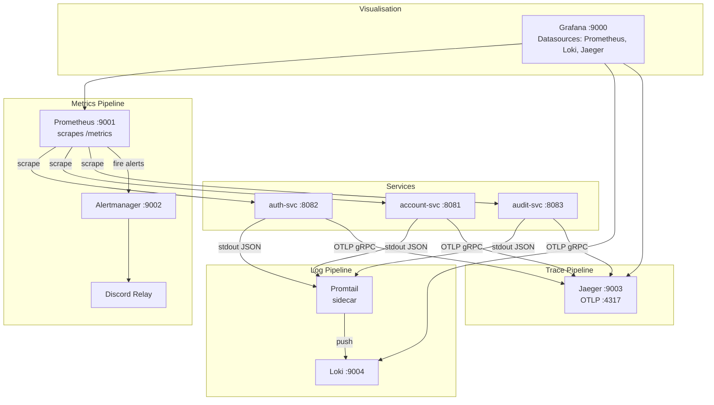

# Skill: Monitoring & Observability Standards

> **Purpose:** Define the logging, metrics, tracing, alerting, dashboard, SLO, and operational readiness standards for all services in this repository. Derived from the monitoring domain and service implementations. Apply when building, reviewing, or operating any service.

---

## 1. Observability Philosophy

Every service in this platform is born observable. Observability is not added after the service works — it is wired during initial construction alongside business logic. The three pillars are treated as infrastructure, not features:

| Pillar | Tool | Where wired |
|---|---|---|
| **Logs** | `slog` → Loki (via Promtail) | `pkg/logger/`, `pkg/middleware/logger.go` |
| **Metrics** | Prometheus (scrape) | `pkg/middleware/metrics.go`, `/metrics` endpoint |
| **Traces** | OpenTelemetry → Jaeger | `pkg/observability/otel.go`, `pkg/middleware/tracing.go` |

Correlation between the three pillars is achieved through:
- `request_id` — generated per HTTP request, included in logs and trace attributes
- `trace_id` — OTEL trace ID, included in log entries via slog OTEL handler
- `user_id` — extracted from JWT claims, included in logs and spans where applicable

---

## 2. Logging Conventions

### 2.1 Library and Format

Always use `slog` (stdlib). Never `fmt.Println`, `log.Printf`, or third-party logging libraries.

```go
// ✅ Correct
slog.InfoContext(ctx, "account created", "account_id", id, "user_id", userID)
slog.WarnContext(ctx, "redis unavailable, falling back to postgres", "error", err)
slog.ErrorContext(ctx, "db query failed", "error", err, "account_id", id)

// ❌ Wrong
fmt.Println("account created:", id)
log.Printf("error: %v", err)
```

### 2.2 Always Use Context Variants

Use `InfoContext`, `WarnContext`, `ErrorContext` — never `Info`, `Warn`, `Error`.
Context variants allow the OTEL slog handler to inject `trace_id` and `span_id` automatically.

### 2.3 Log Levels

| Level | When to use |
|---|---|
| `Error` | Infrastructure failures (DB down, network error, unexpected panic recovery) |
| `Warn` | Degraded mode (Redis fallback, Flipt unavailable, NATS reconnect) |
| `Info` | Significant business events (login success, account created, key revoked) |
| `Debug` | Detailed diagnostic info (only enabled in development, never in production) |

### 2.4 Field Naming

All log fields use snake_case. Standard field names (use these everywhere — consistency enables Loki queries):

| Field | Type | Description |
|---|---|---|
| `account_id` | string | Account identifier |
| `user_id` | string | Authenticated user ID |
| `request_id` | string | Per-request UUID |
| `trace_id` | string | OTEL trace ID (injected automatically) |
| `error` | error | Go error value |
| `method` | string | HTTP method |
| `path` | string | HTTP path |
| `status` | int | HTTP status code |
| `latency_ms` | float64 | Request duration in ms |
| `service` | string | Service name |
| `key_id` | string | API key ID (never hash or raw value) |

### 2.5 What Never to Log

- Raw passwords, tokens, API keys, or their hashes
- PII beyond user ID (no email, no name in logs unless required)
- Large payloads or binary blobs
- Stack traces at Info or Warn level (Error level only, and only the error message + stack)

### 2.6 Structured Log Format

Production output is JSON (configure via `LOG_FORMAT=json`). Development output is text (default).

```go
// pkg/logger/config.go
type Config struct {
    Level       string // "debug" | "info" | "warn" | "error"
    Format      string // "json" | "text"
    ServiceName string
    OTELEnabled bool
}
```

### 2.7 Request Logging Middleware

Every HTTP request is logged by `pkg/middleware/logger.go`. The log entry includes:
- method, path, status, latency_ms, request_id, user_id (if authenticated)

Services must register this middleware on every route — it is part of the standard middleware chain.

---

## 3. Metrics Conventions

### 3.1 Standard Metrics (Auto-generated)

Every service exposes these via `pkg/middleware/metrics.go`:

| Metric | Type | Labels | Purpose |
|---|---|---|---|
| `http_requests_total` | Counter | `service`, `method`, `path`, `status` | Request rate, error rate |
| `http_request_duration_seconds` | Histogram | `service`, `method`, `path`, `status` | Latency distribution |

These are registered automatically by the middleware — services do not need to define them.

### 3.2 Custom Metrics

When a service needs domain-specific metrics, define them in the service package:

```go
var loginFailures = prometheus.NewCounterVec(
    prometheus.CounterOpts{
        Namespace: "auth",
        Name:      "login_failures_total",
        Help:      "Total number of failed login attempts.",
    },
    []string{"reason"},
)

func init() {
    prometheus.MustRegister(loginFailures)
}
```

Naming convention: `{service_namespace}_{noun}_{unit_or_total}` (e.g. `auth_login_failures_total`, `account_balance_operations_total`).

### 3.3 Metrics Endpoint

Every service exposes `GET /metrics` on its primary port. No auth required (internal network).

```go
// routes.go
r.Handle("/metrics", promhttp.Handler())
```

### 3.4 Prometheus Scrape Config

Add each new service to `prometheus.yml`:

```yaml
scrape_configs:
  - job_name: '{service-name}'
    static_configs:
      - targets: ['host.docker.internal:{port}']   # local dev
    # or
      - targets: ['{container-name}:{port}']        # full stack
```

### 3.5 Metric Labels — What Not to Do

Never use high-cardinality values as labels (user IDs, account numbers, trace IDs). Labels create a new time-series per unique value — this will OOM Prometheus.

```go
// ❌ Never do this
httpLabels.With(prometheus.Labels{"user_id": userID})

// ✅ Use a fixed-cardinality label
httpLabels.With(prometheus.Labels{"tenant": "default"})
```

---

## 4. Tracing Conventions

### 4.1 OpenTelemetry Bootstrap

Every service bootstraps OTEL in `cmd/server/container.go`:

```go
otelProvider, err := observability.Bootstrap(ctx, observability.Config{
    ServiceName:    cfg.ServiceName,
    ServiceVersion: cfg.ServiceVersion,
    Endpoint:       cfg.OTELEndpoint,   // default: "localhost:4317"
    Enabled:        cfg.OTELEnabled,
    SamplingRate:   cfg.OTELSamplingRate, // default: 1.0
})
```

When `OTELEnabled=false`, a no-op tracer is used — code is identical, traces are just discarded.

### 4.2 Automatic Spans

The `pkg/middleware/tracing.go` middleware creates a span for every HTTP request. This is always registered. Attributes automatically set:
- `http.method`, `http.route`, `http.status_code`, `http.url`
- `request_id`, `service.name`

### 4.3 Manual Spans for Key Operations

Add spans in the service layer for significant operations — not every function, just those that appear in latency discussions (login, API key introspection, DB queries):

```go
func (s *AuthService) Login(ctx context.Context, username, password string) (*LoginResponse, error) {
    ctx, span := tracer.Start(ctx, "AuthService.Login")
    defer span.End()

    span.SetAttributes(attribute.String("username", username))
    // ...
    if err != nil {
        span.RecordError(err)
        span.SetStatus(codes.Error, err.Error())
        return nil, err
    }
    span.SetAttributes(attribute.String("user_id", user.ID))
    return resp, nil
}
```

### 4.4 Span Naming Convention

`{Layer}.{Method}` — e.g. `AuthService.Login`, `PostgresTokenStore.FindByHash`, `APIKeyService.IntrospectAPIKey`.

### 4.5 OTLP Endpoint

Services push spans to Jaeger via OTLP gRPC:
- Local: `localhost:4317`
- Docker: container name `banking-jaeger:4317` (or via env override)

---

## 5. Dashboard Standards

### 5.1 Tooling

All dashboards are in **Grafana** (port 9000). Datasources are provisioned from `monitoring/grafana/provisioning/datasources/`.

Active datasources:
- **Prometheus** — metrics
- **Loki** — logs
- **Jaeger** — traces

### 5.2 Required Dashboard Panels Per Service

Every service must have a Grafana dashboard with at minimum:

| Panel | Type | Query basis |
|---|---|---|
| Request rate | Time series | `rate(http_requests_total[5m])` by status |
| Error rate | Stat / Time series | `rate(http_requests_total{status=~"5.."}[5m])` |
| P50 / P95 / P99 latency | Time series | `histogram_quantile(0.99, ...)` |
| Active service health | Stat | `/healthz/ready` up/down |
| Top slow endpoints | Table | Sort by P99 latency |
| Recent error logs | Logs panel | Loki query: `{service="{name}"} |= "level=error"` |

### 5.3 Dashboard JSON

Dashboards must be committed to the repository under `monitoring/grafana/provisioning/dashboards/{service-name}.json`. Do not rely on manually created dashboards in Grafana — they will be lost on container restart.

### 5.4 Dashboard Naming

`{Service Name} — Overview` (e.g. `Auth Service — Overview`).

---

## 6. Alerting Standards

### 6.1 Alert Rule Files

Alert rules live in `monitoring/alerting/rules/{service-name}.yml`. Every service has its own file.

### 6.2 Required Alerts Per Service

| Alert | Condition | Severity |
|---|---|---|
| High error rate | `rate(http_requests_total{status=~"5.."}[5m]) > 0.05` | critical |
| High latency P99 | `histogram_quantile(0.99, ...) > 0.5` | warning |
| Service down | `up{job="{service}"} == 0` | critical |
| Readiness probe failing | Derived from `/healthz/ready` | critical |
| Login failure spike | auth-svc only — `rate(auth_login_failures_total[5m]) > 10` | warning |

### 6.3 Alert Format

```yaml
groups:
  - name: auth-svc
    rules:
      - alert: AuthSvcHighErrorRate
        expr: rate(http_requests_total{job="auth-svc",status=~"5.."}[5m]) > 0.05
        for: 2m
        labels:
          severity: critical
          service: auth-svc
        annotations:
          summary: "auth-svc is returning errors"
          description: "Error rate is {{ $value | humanizePercentage }} over the last 5 minutes."
          runbook: "Check /healthz/ready and recent logs in Loki"
```

### 6.4 Alertmanager Routing

Alerts are routed via `monitoring/alertmanager.yml`. Default receiver: Discord relay (`monitoring/discord-relay/`). Escalation routing is per severity label.

---

## 7. SLO / SLI Definitions

### 7.1 Standard SLIs

| SLI | Definition | Tool |
|---|---|---|
| **Availability** | `sum(rate(http_requests_total{status!~"5.."}[5m])) / sum(rate(http_requests_total[5m]))` | Prometheus |
| **Latency** | P99 of `http_request_duration_seconds` | Prometheus |
| **Error budget** | `1 - availability` | Derived |

### 7.2 SLO Targets (from goals.md NFR section)

| Service | Endpoint | Availability SLO | Latency SLO (P99) |
|---|---|---|---|
| auth-svc | `/auth/login` | 99.9% | ≤ 500 ms |
| auth-svc | `/auth/refresh` | 99.9% | ≤ 100 ms |
| auth-svc | `/auth/apikey/introspect` | 99.99% | ≤ 10 ms (cache hit) |

Each service's goals.md defines the SLO targets for that service. This file defines the measurement methodology.

### 7.3 SLO Panels

Every Grafana dashboard must include an SLO panel showing:
- Current availability (28-day rolling window)
- Error budget remaining
- Current P99 latency vs target

---

## 8. Health Check Standards

### 8.1 Endpoints

Every service must expose:

| Endpoint | Purpose | Expected response |
|---|---|---|
| `GET /healthz/live` | Liveness — is the process alive? | Always `200 OK` |
| `GET /healthz/ready` | Readiness — can it serve traffic? | `200 OK` if all checks pass; `503` otherwise |

### 8.2 Readiness Check Implementation

```go
// pkg/observability/health.go
type HealthHandler struct {
    checks map[string]CheckFn
}

func (h *HealthHandler) Ready(w http.ResponseWriter, r *http.Request) {
    results := map[string]string{}
    allOK := true
    for name, check := range h.checks {
        if err := check(r.Context()); err != nil {
            results[name] = err.Error()
            allOK = false
        } else {
            results[name] = "ok"
        }
    }
    status := http.StatusOK
    if !allOK {
        status = http.StatusServiceUnavailable
    }
    httpx.WriteHTTPStatus(w, status, map[string]any{"ready": allOK, "checks": results})
}
```

### 8.3 What to Check in Readiness

| Dependency | Always check | Notes |
|---|---|---|
| PostgreSQL | ✅ | `db.PingContext(ctx)` |
| Redis | Only if `TOKEN_STORE=redis` or API key cache is enabled | `client.Ping(ctx)` |
| NATS | ❌ | NATS failure does not impair service functionality |
| Flipt | ❌ | Flipt failure does not impair service functionality |

Liveness check is always 200 — it just confirms the process hasn't deadlocked.

---

## 9. Operational Readiness Checklist

Use this before marking a service as production-ready:

### Logging
- [ ] All request logs include `request_id`, `method`, `path`, `status`, `latency_ms`
- [ ] Error-level logs include `error` field with Go error value
- [ ] No secrets appear in logs (verified by test + grep)
- [ ] Log level configurable via env var

### Metrics
- [ ] `GET /metrics` returns Prometheus text format
- [ ] `http_requests_total` and `http_request_duration_seconds` present
- [ ] Prometheus scrape config committed to `prometheus.yml`
- [ ] Service label matches job name in alerting rules

### Tracing
- [ ] OTEL bootstrap wired in container
- [ ] Per-request span created by middleware
- [ ] Service-layer spans added for operations named in NFR targets
- [ ] `trace_id` appears in log entries

### Dashboards & Alerts
- [ ] Grafana dashboard JSON committed to provisioning folder
- [ ] Alert rules file committed for this service
- [ ] Critical alert fires on service down test
- [ ] Runbook URL in alert annotation (even if minimal)

### Health Checks
- [ ] `/healthz/live` always returns 200
- [ ] `/healthz/ready` returns 503 when Postgres is unreachable
- [ ] Readiness probe configured in docker-compose

### Incident Response Considerations
- [ ] On-call knows which Grafana dashboard to open first
- [ ] Log queries for common failure modes documented
- [ ] Runbook covers: service down, high error rate, high latency, DB unreachable

---

## 10. Monitoring Architecture



---

## 11. Adding a New Service to the Monitoring Stack

When a new service is created (e.g. `payment-svc` on port 8084):

1. **Metrics** — Add to `prometheus.yml`:
   ```yaml
   - job_name: 'payment-svc'
     static_configs:
       - targets: ['host.docker.internal:8084']
   ```

2. **Logs** — Promtail auto-discovers Docker containers. No config change needed if the container logs to stdout.

3. **Traces** — Set `OTEL_EXPORTER_OTLP_ENDPOINT=jaeger:4317` in the service's env. OTEL bootstrap handles the rest.

4. **Alerts** — Create `monitoring/alerting/rules/payment-svc.yml` with at minimum: service down, high error rate, high latency.

5. **Dashboard** — Create `monitoring/grafana/provisioning/dashboards/payment-svc.json` with the required panels.

6. **Docker Compose** — Add the service to the microservices `docker-compose.yml` and ensure it joins `banking-net`.
